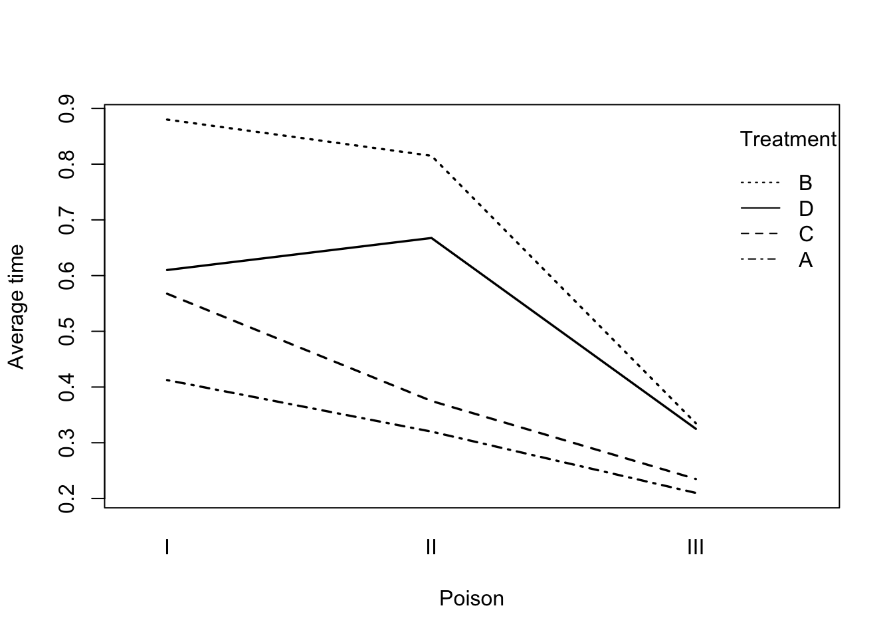

# Analysis of designed experiments
So far in the module we have focused on models with at least one continuous covariate. In this chapter we will consider how to handle models with exclusively categorical variables, in the context of designed experiments.

## Completely randomised design
A completely randomised design occurs when all experimental units are drawn from the same 'population' of interest. In this scenario, there are no obvious 'groupings' where members of different groups might be expected to respond differently. 'Treatments' are then applied to the experimental units - this is an example of a *factor* which can take $k$ values, one for each of $k$ potential treatments. A sensible initial model might be

\[
\color{red}{Y_{ij} = \mu + \alpha_i + \epsilon_{ij}}
\]

for $i = 1, \ldots, k$ and $j = 1, \ldots n_i$ where $k$ is the number of treatments or factor values, $n_i$ is the number of observations on the $i^{th}$ treatment. We make the usual assumptions about the error terms, $\epsilon_{ij}$. In this model:

- <span style="color: red;">$\mu$ denotes an overall mean</span>
- <span style="color: red;">$\alpha_i$ is the additional effect of the $i^{th}$ treatment.</span>

However, this is an *over-parameterised* model since we have $k + 1$ parameters and essentially only $k$ pieces of information, the sample means for each treatment group, to estimate them from. Thus we must make some (further) assumptions concerning the $\alpha_i$ parameters. The most commonly adopted assumption is to take $\alpha_1$ to be zero. Thus, under this assumption, 

<ol type="i">
<li> <span style="color: red;">the mean of the first group is given by $\mu$</span></li>
<li> <span style="color: red;">the mean of the $i^{th}$ group by $\mu + \alpha_i$ for $i = 2, 3, \ldots, k$</span></li>
</ol>
<br>
We can then set this model up as a linear model and estimate the parameters using our general theory established in chapter 1. 

## Example: One-way anova {-}
We shall demonstrate this design with a simple example. An experiment was carried out to determine the effects of four treatments $A, B, C$ and $D$ on a certain crop. A field was divided into $12$ plots and $3$ replicates of each of the $4$ treatments were randomly assigned to the plots. The following data were recorded:

<table class="table" style="width: auto !important; margin-left: auto; margin-right: auto;">
<thead><tr>
<th style="border-bottom:hidden;padding-bottom:0; padding-left:3px;padding-right:3px;text-align: center; " colspan="1"><div style="border-bottom: 1px solid #ddd; padding-bottom: 5px; ">Treatment</div></th>
<th style="border-bottom:hidden;padding-bottom:0; padding-left:3px;padding-right:3px;text-align: center; " colspan="3"><div style="border-bottom: 1px solid #ddd; padding-bottom: 5px; ">Yield</div></th>
<th style="border-bottom:hidden;padding-bottom:0; padding-left:3px;padding-right:3px;text-align: center; " colspan="1"><div style="border-bottom: 1px solid #ddd; padding-bottom: 5px; ">Total</div></th>
<th style="border-bottom:hidden;padding-bottom:0; padding-left:3px;padding-right:3px;text-align: center; " colspan="1"><div style="border-bottom: 1px solid #ddd; padding-bottom: 5px; ">Mean</div></th>
</tr></thead>
<tbody>
  <tr>
   <td style="text-align:left;"> A </td>
   <td style="text-align:right;"> 33.63 </td>
   <td style="text-align:right;"> 37.80 </td>
   <td style="text-align:right;"> 36.58 </td>
   <td style="text-align:right;"> 108.01 </td>
   <td style="text-align:right;"> 36.00 </td>
  </tr>
  <tr>
   <td style="text-align:left;"> B </td>
   <td style="text-align:right;"> 35.83 </td>
   <td style="text-align:right;"> 38.18 </td>
   <td style="text-align:right;"> 37.89 </td>
   <td style="text-align:right;"> 111.90 </td>
   <td style="text-align:right;"> 37.30 </td>
  </tr>
  <tr>
   <td style="text-align:left;"> C </td>
   <td style="text-align:right;"> 42.92 </td>
   <td style="text-align:right;"> 40.43 </td>
   <td style="text-align:right;"> 41.46 </td>
   <td style="text-align:right;"> 124.81 </td>
   <td style="text-align:right;"> 41.60 </td>
  </tr>
  <tr>
   <td style="text-align:left;"> D </td>
   <td style="text-align:right;"> 38.02 </td>
   <td style="text-align:right;"> 39.62 </td>
   <td style="text-align:right;"> 35.99 </td>
   <td style="text-align:right;"> 113.63 </td>
   <td style="text-align:right;"> 37.88 </td>
  </tr>
</tbody>
</table>

Comment: There is clearly some variability between our treatments. What we want to know is whether this is just chance or is there evidence of a genuine difference between treatments? By inspection, $C$ seems to have a higher mean than the other 3 treatments. 

We can set this up as a linear model
\[
\vec{Y} = \up{X}\vec{\beta} + \vec{\epsilon}
\]

where, from the data above, we have:
\begin{align*}
\vec{y} =
\begin{pmatrix}
    33.63 \\
	37.80 \\
 	36.58 \\
 	35.83 \\ 38.18 \\ 37.89 \\ 42.92 \\ 40.43 \\ 41.46 \\ 38.02 \\ 39.62 \\ 35.99 \\
         \end{pmatrix}, 
         	\up{X} =
     \begin{pmatrix}
	1& 0& 0& 0  \\
	1& 0& 0& 0  \\
	1& 0& 0& 0  \\
	1& 1& 0& 0  \\
	1& 1& 0& 0  \\
	1& 1& 0& 0  \\
	1& 0& 1& 0  \\
	1& 0& 1& 0  \\
	1& 0& 1& 0  \\
	1& 0& 0& 1  \\
	1& 0& 0& 1  \\
	1& 0& 0& 1  \\
         \end{pmatrix},
         \vec{\beta} = \begin{pmatrix}
        \mu \\
	\alpha_2 \\
	\alpha_3 \\
	\alpha_4 \\
         \end{pmatrix},
         \vec{\epsilon} =    \begin{pmatrix}
       	\epsilon_1 \\
	\epsilon_2 \\
	\epsilon_3 \\
	\epsilon_4 \\
  \epsilon_5 \\
	\epsilon_6 \\
	\epsilon_7 \\
	\epsilon_8 \\
  \epsilon_9 \\
	\epsilon_{10} \\
	\epsilon_{11} \\
	\epsilon_{12}
         \end{pmatrix} ,
   \end{align*}

Then we have seen from the general theory, given in chapter 1, that the parameter estimates are
\[
\color{red}{\vec{\hat{\beta}} = (\up{X}^T\up{X})^{-1}\up{X}^T\vec{Y}}
\]

where
\begin{align*}
\color{red}{\up{X}^T\up{X} =
\begin{pmatrix}
12& 3& 3& 3 \\
 3& 3& 0& 0  \\
 3& 0& 3& 0 \\
 3& 0& 0& 3 \\
\end{pmatrix},
\up{X}^T\vec{y} = \begin{bmatrix}
\sum_{i,j} y_{ij}\\
\sum_{j=1}^3 y_{2j} \\
\sum_{j=1}^3 y_{3j} \\
\sum_{j=1}^3 y_{4j} \\
\end{bmatrix} = \begin{bmatrix}
458.35 \\
111.90 \\
124.81 \\
113.63 \\
\end{bmatrix}}
\end{align*}
and
\begin{align*}
(\up{X}^T\up{X})^{-1} =
\begin{pmatrix}
1/3& -1/3& -1/3& -1/3  \\
-1/3& 2/3& 1/3& 1/3  \\
-1/3& 1/3& 2/3& 1/3  \\
-1/3& 1/3& 1/3& 2/3  \\
\end{pmatrix}
\end{align*}

This leads to $\vec{\hat{\beta}} = (\bar{y}_1, \bar{y}_2 - \bar{y}_1, 
\bar{y}_3 - \bar{y}_1, \bar{y}_4 - \bar{y}_1)^T$
where $\bar{y_i}$ is the mean of the $i^{th}$ group. Note that since, as in chapter one, $\Var\left({\vec{\hat{\beta}}}\right) = (\up{X}^T\up{X})^{-1}\sigma_{\epsilon}^2$, all the parameter estimates are correlated. We can then use anova to test

- $H_0: \alpha_2 = \alpha_3 = \alpha_4 = 0$ versus
- $H_1$: at least one of the $\alpha_i$ is non-zero

The anova table used to test these hypotheses is of the general form:

<table class="table table-striped" style="width: auto !important; margin-left: auto; margin-right: auto;">
 <thead>
  <tr>
   <th style="text-align:left;"> Source </th>
   <th style="text-align:left;"> Degrees of freedom (df) </th>
   <th style="text-align:left;"> Sum of squares (SS) </th>
   <th style="text-align:left;"> Mean square (MS) </th>
   <th style="text-align:left;"> MSR </th>
  </tr>
 </thead>
<tbody>
  <tr>
   <td style="text-align:left;"> Treatment </td>
   <td style="text-align:left;"> k-1 </td>
   <td style="text-align:left;"> Trt SS </td>
   <td style="text-align:left;"> $\text{Trt MS}\, = \frac{\text{Trt SS}}{k-1}$ </td>
   <td style="text-align:left;"> $F = \frac{\text{Trt MS}}{\text{RMS}}$ </td>
  </tr>
  <tr>
   <td style="text-align:left;"> Residual </td>
   <td style="text-align:left;"> n-k </td>
   <td style="text-align:left;"> RSS </td>
   <td style="text-align:left;"> $\text{RMS} = \frac{\text{RSS}}{n - k}$ </td>
   <td style="text-align:left;">  </td>
  </tr>
  <tr>
   <td style="text-align:left;"> Total </td>
   <td style="text-align:left;"> n - 1 </td>
   <td style="text-align:left;"> TSS </td>
   <td style="text-align:left;">  </td>
   <td style="text-align:left;">  </td>
  </tr>
</tbody>
</table>

where $n$ is the sample size and $k$ is the number of 'treatments'. Similarly to chapter 3, we thus have a breakdown of the total variability as

\[
\color{red}{\text{Total SS (TSS)} = \text{Treatment SS} + \text{Residual SS}}.
\]

We then compare the $F$-statistic with $F$-tables on $k-1$ (from the 'treatment' row) and $n - k$ (from the residual row) degrees of freedom, rejecting the null hypothesis if the $F$-statistic is large relative to the tables, and calculating a $p$-value in the usual way.

### Analysis of completely randomised design data in `R`
We enter the data as

``` r
yield <- c(33.63, 37.80, 36.58, 35.83, 38.18, 37.89, 
             42.92, 40.43, 41.46, 38.02, 39.62, 35.99)
treat <- c("A", "A", "A", "B", "B", "B", "C", "C", "C", "D", "D", "D")
treatf <- as.factor(treat)
# Or alternatively (more directly)
treatf <- gl(4, 3, 12, labels = c("A", "B", "C", "D"))
```

The analysis then proceeds as


``` r
fitaov <- aov(yield ~ treatf)
summary(fitaov)           	
```

```
##             Df Sum Sq Mean Sq F value Pr(>F)  
## treatf       3  51.97  17.322   6.235 0.0173 *
## Residuals    8  22.23   2.778                 
## ---
## Signif. codes:  0 '***' 0.001 '**' 0.01 '*' 0.05 '.' 0.1 ' ' 1
```

<span style="color: red;">Comment: As the $F$-value is large and the $p$-value small ($<0.05$), we reject the null hypothesis and say there is a difference in mean yields amongst the treatment groups. Where might these differences lie?</span>

### Interpretation of results: multiple comparisons
If the overall $F$-value is significant ($p < 0.05$), we want to investigate further to see which treatment groups differ significantly, i.e. where do the differences lie? We can do this using Tukey’s honest significant differences which takes account of the multiple testing problem (by adjusting the $p$-values).

Tukey's test compares the mean of each group to the mean of every other group, i.e. it considers every possible pair $\mu_A - \mu_B$ for $A, B = 1, \ldots, k, A \neq B$. The test statistic is formulated as

\[
q = \frac{\mu_A - \mu_B}{s\sqrt{0.5 \left(\frac{1}{n_A} + \frac{1}{n_B}\right)}}
\]

where $s$ is the square root of the residual mean square and $n_A$ and $n_B$ are the sample sizes for treatment $A$ and $B$ respectively. These $q$ values (one for each pairwise comparison) are then compared to a critical value, $q_{t, \nu}(\alpha)$, from the studentised range distribution (available in `R` via `qtukey()`), where $t$ is the number of treatments, $\nu$ is the residual degrees of freedom and $\alpha$ is the overall significance level for all of the comparisons, not each individual comparison.

With $k$ groups we have, in principle, $k(k-1)/2$ possible $t$-tests that can be done. As $k$ increases we would be doing many tests and some will be significant by chance. The Tukey’s comparisons show us which group means differ significantly, whilst allowing for this multiple testing.

## Example: Multiple comparisons {-}
We can calculate Tukey's honest significant differences (HSD) in `R` as follows:

``` r
TukeyHSD(fitaov)
```

```
##   Tukey multiple comparisons of means
##     95% family-wise confidence level
## 
## Fit: aov(formula = yield ~ treatf)
## 
## $treatf
##           diff         lwr       upr     p adj
## B-A  1.2966667 -3.06163127 5.6549646 0.7786392
## C-A  5.6000000  1.24170206 9.9582979 0.0142896
## D-A  1.8733333 -2.48496461 6.2316313 0.5456469
## C-B  4.3033333 -0.05496461 8.6616313 0.0529252
## D-B  0.5766667 -3.78163127 4.9349646 0.9727893
## D-C -3.7266667 -8.08496461 0.6316313 0.0962564
```

<span style="color: red;">Comments: This tells us that $A$ and $C$ differ significantly in mean and that $B$ and $C$ are approaching significance, and $D$ and $C$ are weakly significant. There is no evidence of any difference in mean between $A, B$ and $D$. $C$ however seems to be different. This is what was suggested by inspection of the treatment means earlier.</span>

### Model checking
It is much less common to have highly influential points in an anova context as several observations typically come from each possible treatment/factor level, which provides a measure of robustness. However, it is useful to conduct a conventional residual check by plotting the standardised residuals against the fitted values to check for constant variance and outliers, and to produce a quantile-quantile plot to check for normality, alongside a formal test (via Anderson-Darling). This is done as before, i.e.


``` r
plot(fitted.values(fitaov), rstandard(fitaov), 
       xlab="Fitted values", ylab="Standardised residuals", pch = 16)
abline(h = c(-2, 0, 2), lty = 2)
qqnorm(rstandard(fitaov), ylab="Standardised residuals", pch = 16)
abline(0, 1, lty = 2)
```

<div class="figure" style="text-align: center">

<p class="caption">(\#fig:cropresids)Residual plots for the crop yield data.</p>
</div>


``` r
library(nortest)
ad.test(rstandard(fitaov))
```

```
## 
## 	Anderson-Darling normality test
## 
## data:  rstandard(fitaov)
## A = 0.32721, p-value = 0.466
```

From the Anderson-Darling test we obtain a $p$-value of 0.466, suggesting that normality of the residuals can be safely assumed.

#### Comments {-}

<span style="color: red;">- We see an approximately random scatter in the first plot, implying constant variance. All the standardised residuals lie in $[-2,2]$ and so no outliers.<br> 
- The second plot fits quite well to a straight line implying approximate normality of the residuals and the large $p$-value implies that there is no significant departure from normality.</span>

### Completely randomised design: dealing with quantitative variables
Sometimes the treatments are quantitative levels of an additive, or particular levels of an underlying continuous variable such as temperature, or pressure. For example: 0, 5, 10, 20, 30 grams of supplement, such as creatine, in the diet with three individuals allocated to each treatment. This should be analysed as a regression problem with multiple observations at each $x$-value. When handling quantitative variables we must also consider the functional form of the covariate, i.e. is the effect linear, or quadratic? 

### Example: Randomised design with a quantitative variable {-}
The data in this example are the amount of grain obtained at various plant densities (per square metre), available in the file *grain.RData*. An exploratory plot allows us to see the structure of the data, and look for patterns which may suggest candidate models.

<div class="figure" style="text-align: center">

<p class="caption">(\#fig:grainplot)Exploratory plot for the grain and plant density data.</p>
</div>

We observe clear non-linearity in the relationship between grain and plant density. This suggests that a polynomial (i.e. a quadratic in this case) model may be appropriate, or we can treat $x$ as a factor.

In cases such as this, we have to choose whether to treat $x$ as a continuous covariate, or to convert it to a factor - there are pros and cons to either approach. A continuous variable

\+ <span style="color: red;">may offer a simpler interpretation (and allow predictions for intermediate values)</span><br> 
\- <span style="color: red;">may overlook more complex relationships between the response and the covariate unless we resort to high-order polynomials. </span>

On the other hand, a factor will use $k-1$ degrees of freedom (for a variable with $k$ levels) but will estimate each level separately. In this case, we see that yield increases with plant density up to a maximum and then declines again. This is possibly indicative of a quadratic model, which we will now fit to the data, along with the factor model.

#### Quadratic model {-}
We can fit a quadratic model in various ways - see subsection \@ref(sec:polymodels). Here we will use the raw polynomial version:


``` r
fit_poly <- lm(y ~ poly(x, 2, raw = TRUE), data = grain)
anova(fit_poly)
```

```
## Analysis of Variance Table
## 
## Response: y
##                        Df Sum Sq Mean Sq F value    Pr(>F)    
## poly(x, 2, raw = TRUE)  2  85.20  42.600  51.741 1.259e-06 ***
## Residuals              12   9.88   0.823                      
## ---
## Signif. codes:  0 '***' 0.001 '**' 0.01 '*' 0.05 '.' 0.1 ' ' 1
```

<span style="color: red;">Comment: We see from above that the polynomial model is highly significant, with a very small $p$-value. This does not, however, tell us about the relative contributions of the linear and quadratic terms (the above is another example of an omnibus test).
</span>

#### Factor model {-}
Alternatively, we can recast $x$ as a factor. This, in fact, leads to a *one-way analysis of variance* model. As such, we can analyse it using the `aov()` command (or `lm()` as usual).


``` r
(grain$x.factor <- factor(grain$x/10))
```

```
##  [1] 1 1 1 2 2 2 3 3 3 4 4 4 5 5 5
## Levels: 1 2 3 4 5
```

``` r
fit_factor <- aov(y ~ x.factor, data = grain)
anova(fit_factor)
```

```
## Analysis of Variance Table
## 
## Response: y
##           Df Sum Sq Mean Sq F value   Pr(>F)    
## x.factor   4  87.60  21.900  29.278 1.69e-05 ***
## Residuals 10   7.48   0.748                     
## ---
## Signif. codes:  0 '***' 0.001 '**' 0.01 '*' 0.05 '.' 0.1 ' ' 1
```

<span style="color: red;">Comment: The $F$-test shows that there is a significant difference between the 5 treatment levels, which was obvious from our plot.</span>

#### Choosing between non-nested models {-}
We can assess each fit by eye by plotting the fitted values (at each distinct $x$ value) and overlaying the lines of best fit. Note that the quadratic model produces a continuous curve for the mean response, whereas the factor model is piecewise linear. The fits are very close though and there is no obvious preference based on the figure alone.

<div class="figure" style="text-align: center">

<p class="caption">(\#fig:fittedgrainplot)Fitted models for the grain and plant density data: blue (polynomial), red(factor).</p>
</div>

Our two candidate models are *non-nested*, i.e. one is not a subset of another. The respective $R^2$ values for the quadratic and factor models are $89.6\%$ and $92.1\%$. We may be guilty of overfitting in the factor model - ideally we would like to validate this result in another dataset. Often we choose a simpler model, even if it has lower values of $R^2$ and higher RMS. Note in passing that the adjusted $R^2$ values are $87.9\%$ and $89.0\%$. 

Choosing a model is *subjective* and you must use your judgement. Here, we may opt for the simpler quadratic model as there is little difference between the models and this is better for predictive purposes. We also check the residuals - if these flag up any concerns we may revert to an alternative model:

<div class="figure" style="text-align: center">

<p class="caption">(\#fig:grainresidplot)Residual plots for the polynomial model fitted to the grain data.</p>
</div>

In this case the residuals checks are fine and the model also has standardised residuals that yield a p-value $>0.1$ for the Anderson-Darling test:


``` r
ad.test(rstandard(fit_poly))
```

```
## 
## 	Anderson-Darling normality test
## 
## data:  rstandard(fit_poly)
## A = 0.21793, p-value = 0.8041
```

## Randomised block design
A randomised block design is the most commonly used design in practice. Background: often the experimental units are grouped such that those in a group (year, farm, day, laboratory) are expected to respond similarly to a treatment, but different groups are expected to respond differently. 

The groups are called *blocks*. Essentially the blocking factor is a `nuisance factor'; we know it probably affects the response but we are not that interested in it per se. However we need to correct for it to make our treatment comparisons more exact, i.e. by reducing the residual mean square (i.e. the variance). Randomised block designs are analysed with a *two-way analysis of variance*. 

### Two-way analysis of variance
In a one-way anova we look for the effect of one factor, in a two-way anova we look for the effects of two factors. The second factor may also be of genuine interest, or it may be a *blocking* or *nuisance factor* (c.f. the paired sample t-test). A further complication arises because of the possibility of *interactions* between the factors, namely do the treatments work differently in the different groups? We will consider interactions later.

The different values of a factor are called 'levels'. A factorial experiment is one where all of the explanatory variables are qualitative factors rather than quantitative variables. We will later consider cases where we have both factors and quantitative explanatory variables.

Typically, we are interested in a randomised block design when we have models of the form:

\[
\color{red}{Y_{ij} = \mu + \alpha_i + \beta_j + \epsilon_{ij}}
\]

where $i = 1, 2, \ldots, k_1$ refer to the levels of factor 1 and $j = 1, 2, \ldots, k_2$ refer to the levels of factor 2. We make the usual assumption of normally distributed errors with constant variance. As with single factor experiments, we must make assumptions in order to estimate these parameters, since this model is again over-parameterised otherwise. We now (further) assume that $\alpha_1 = \beta_1 = 0$. The additional source of variation leads to an extra row in the anova table.

We now have a further breakdown of the total variability as

\[
\color{red}{\text{Total SS (TSS)} = \text{Treatment SS} + \text{Block SS} + \text{Residual SS}}.
\]

Without the blocking factor, this source of variation is absorbed into the residual sum of squares, which affects the significance of the treatments.

### Orthogonality and testing of blocks in a two-way analysis of variance model
If each treatment occurs an equal number of times in each block, then the estimates of the treatment effects are uncorrelated with those of the blocks. The two factors are then said to be *orthogonal*; if there is not equal replication then the sums of squares depends on the order of fitting and, to avoid bias, we fit the blocking factor first. Generally, if the $F$-statistic for blocks exceeds unity (i.e. $> 1$) then it is advantageous to have used blocks. The treatment comparison will then be more accurate. We will now consider an example.

### Example: Two-way anova on nitrate data {-}
Six nitrogen timing treatments were used in six fields in each of four farms (the *blocking* factor), giving $n = 24$, and the resulting nitrate in wheat stems was assayed. The data were analysed to produce the anova table below:

<table class="table table-striped" style="width: auto !important; margin-left: auto; margin-right: auto;">
 <thead>
  <tr>
   <th style="text-align:left;"> Source </th>
   <th style="text-align:right;"> Degrees of freedom </th>
   <th style="text-align:right;"> Sum of squares </th>
   <th style="text-align:left;"> Mean square </th>
   <th style="text-align:left;"> Mean square ratio </th>
  </tr>
 </thead>
<tbody>
  <tr>
   <td style="text-align:left;"> Farms </td>
   <td style="text-align:right;"> 3 </td>
   <td style="text-align:right;"> 197.00 </td>
   <td style="text-align:left;"> 65.67 </td>
   <td style="text-align:left;"> 9.12 </td>
  </tr>
  <tr>
   <td style="text-align:left;"> Timings </td>
   <td style="text-align:right;"> 5 </td>
   <td style="text-align:right;"> 201.32 </td>
   <td style="text-align:left;"> 40.26 </td>
   <td style="text-align:left;"> 5.59 </td>
  </tr>
  <tr>
   <td style="text-align:left;"> Residual </td>
   <td style="text-align:right;"> 15 </td>
   <td style="text-align:right;"> 108.01 </td>
   <td style="text-align:left;"> 7.20 </td>
   <td style="text-align:left;">  </td>
  </tr>
  <tr>
   <td style="text-align:left;"> Total </td>
   <td style="text-align:right;"> 23 </td>
   <td style="text-align:right;"> 506.33 </td>
   <td style="text-align:left;">  </td>
   <td style="text-align:left;">  </td>
  </tr>
</tbody>
</table>

<span style="color: red;">There is a large difference between farms ($F >> 1$). Thus blocking was worthwhile. There are significant differences between timings - these could be investigated using Tukey’s HSD as before. The adequacy of the model is checked by residual plots as usual. </span>

### Example: Chicken egg production {-}
An experiment was conducted at each of four units to see if extra lighting increased egg production by chickens during the winter months. The treatments were

<ol type="i">
<li> natural daylight; </li>
<li> extended day length to 14 hours using artificial lighting; </li>
<li> two 20 second light periods during the night. </li>
</ol>

The number of eggs laid by six chickens in a three-month period was recorded: 

<table class="table table-striped" style="width: auto !important; margin-left: auto; margin-right: auto;">
 <thead>
  <tr>
   <th style="text-align:right;"> Treatment </th>
   <th style="text-align:right;"> Unit 1 </th>
   <th style="text-align:right;"> Unit 2 </th>
   <th style="text-align:right;"> Unit 1 </th>
   <th style="text-align:right;"> Unit 4 </th>
  </tr>
 </thead>
<tbody>
  <tr>
   <td style="text-align:right;"> 1 </td>
   <td style="text-align:right;"> 330 </td>
   <td style="text-align:right;"> 288 </td>
   <td style="text-align:right;"> 295 </td>
   <td style="text-align:right;"> 313 </td>
  </tr>
  <tr>
   <td style="text-align:right;"> 2 </td>
   <td style="text-align:right;"> 372 </td>
   <td style="text-align:right;"> 340 </td>
   <td style="text-align:right;"> 343 </td>
   <td style="text-align:right;"> 341 </td>
  </tr>
  <tr>
   <td style="text-align:right;"> 3 </td>
   <td style="text-align:right;"> 359 </td>
   <td style="text-align:right;"> 337 </td>
   <td style="text-align:right;"> 373 </td>
   <td style="text-align:right;"> 302 </td>
  </tr>
</tbody>
</table>

The data are available on Canvas in the data file *ChickenEggs.RData*. We can carry out a two-way anova in `R` as follows:

``` r
load("ChickenEggs.RData")
fitaov <- aov(eggs ~ unit + light, data = ChickenEggs)
summary(fitaov)
```

```
##             Df Sum Sq Mean Sq F value Pr(>F)  
## unit         3   2330   776.8   2.008 0.2145  
## light        2   4212  2106.2   5.444 0.0449 *
## Residuals    6   2322   386.9                 
## ---
## Signif. codes:  0 '***' 0.001 '**' 0.01 '*' 0.05 '.' 0.1 ' ' 1
```

#### Comments {-}
1. <span style="color: red;">$F$-ratio for units (blocks) is greater than 1 so the treatment comparison was made more exact by blocking, but the differences between units were not large.</span>
1. <span style="color: red;">The differences between treatment were significant ($p=0.045$). </span>

We can now use Tukey’s HSD (via `R`) to see where the differences are:


``` r
TukeyHSD(fitaov)
```

```
##   Tukey multiple comparisons of means
##     95% family-wise confidence level
## 
## Fit: aov(formula = eggs ~ unit + light, data = ChickenEggs)
## 
## $unit
##          diff       lwr      upr     p adj
## 2-1 -32.00000 -87.59733 23.59733 0.2874709
## 3-1 -16.66667 -72.26400 38.93066 0.7356765
## 4-1 -35.00000 -90.59733 20.59733 0.2308903
## 3-2  15.33333 -40.26400 70.93066 0.7785977
## 4-2  -3.00000 -58.59733 52.59733 0.9974306
## 4-3 -18.33333 -73.93066 37.26400 0.6802599
## 
## $light
##      diff         lwr      upr     p adj
## 2-1 42.50  -0.1764142 85.17641 0.0507874
## 3-1 36.25  -6.4264142 78.92641 0.0891770
## 3-2 -6.25 -48.9264142 36.42641 0.8965079
```

<span style="color: red;">We see that there is a borderline significant difference in means between treatments 1 and 2. The difference between 1 and 3 is approaching significance and there is no evidence of a difference between treatments 2 and 3. Thus, extra lighting seems to increase egg production, but there is little difference between the two extra light treatments. As expected from the $p$-value there is no significant differences between the units themselves.</span>

We can check model adequacy in the usual way:

```
## 
## 	Anderson-Darling normality test
## 
## data:  rstandard(fitaov)
## A = 0.256, p-value = 0.6577
```

<div class="figure" style="text-align: center">

<p class="caption">(\#fig:eggresidplot)Residual plots for the two-way anova model on the chicken egg data.</p>
</div>

From the left-hand plot we see there is random scatter with no evidence of curvature or changing variance, and no outliers. There is a good fit to the straight line on the right-hand plot, and a large $p$-value from the Anderson-Darling test, implying the normality assumption is fine. 

<!-- ### Contrasts -->
<!-- Sometimes, given our knowledge of what the treatments are, we might want to test certain comparisons which are not just comparing individual groups. To do this we can define contrasts, subject to the following constraints: -->

<!-- <ol type="i"> -->
<!-- <li> <span style="color: red;">The coefficients must sum to zero for each contrast.</span> </li> -->
<!-- <li> <span style="color: red;">The number of contrasts should be equal to the number of treatments - 1 (i.e. the degrees of freedom).</span> </li> -->
<!-- <li> <span style="color: red;">The contrasts should be chosen so that they are orthogonal to each other (i.e. the product of any pair of contrasts $= 0$). </span> </li> -->
<!-- </ol> -->

<!-- We can then test if any of the contrasts are significantly different from zero. Using `R`, we can generate a $t$-statistic, testing if the true value of the contrast is zero, with an associated $p$-value that can be interpreted in the usual way so that small $p$-values imply the contrast is significantly different from zero. -->

<!-- ### Example: Contrasts for the chicken egg production data -->
<!-- In the example on whether lighting affected egg production, the two most obvious comparisons are: -->

<!-- 1. the average of the two enhanced light treatments against standard daylight ($\text{contrast} = (-1, 0.5,0.5)$) and  -->
<!-- 1. comparing the two enhanced light treatments ($\text{contrast} = (0, 1, -1)$). -->

<!-- These contrasts satisfy the conditions since each sums to zero, and there are two contrasts for the three levels of light. Furthermore, they are orthogonal since: -->

<!-- \begin{align*} -->
<!-- \begin{matrix}\begin{pmatrix}-1.0& 0.5& 0.5\end{pmatrix}\\\mbox{}\end{matrix} -->
<!-- \begin{pmatrix} -->
<!--     0.0 \\ -->
<!-- 	 1.0 \\ -->
<!--  	-1.0 \\ -->
<!--          \end{pmatrix} = (-1 \times 0) + (0.5 \times 1) + (0.5 \times (-1)) = 0 -->
<!-- \end{align*} -->

<!-- Using `R` to carry out the analysis: -->
<!-- ```{r} -->
<!-- ContrastMatrix1 <-  cbind(c(-1, 0.5, 0.5), c(0, 1, -1)) -->
<!-- contrasts(ChickenEggs$light) <- ContrastMatrix1 -->
<!-- summary.lm(aov(eggs ~ unit + light, data = ChickenEggs)) -->
<!-- ``` -->

<!-- #### Comments {-} -->

<!-- 1. <span style="color: red;">The first contrast is significant ($p = 0.0171$) and positive, implying that the mean of the light treatments is greater than the mean of the natural daylight. </span> -->
<!-- 1. <span style="color: red;">The second contrast has a large $p$-value, implying no significant differences in mean between the two light treatments. </span> -->
<!-- 1. <span style="color: red;">As we have not specified contrasts for units, `R` has compared each unit against the first unit. </span> -->
<!-- 1. <span style="color: red;">All of these comparisons are non-significant, implying little difference between units. </span> -->


## Factorial experiments
Sometimes, when there are two factors in an experiment, both are of genuine, and equal, interest and we are interested as to whether they are each important. In addition, we may wish to consider whether they interact, i.e. whether the level of one factor affects the effect of the other factor.

We are thus interested in fitting a model of the form:

\[
\color{red}{Y_{ij} = \mu + \alpha_i + \beta_j + \gamma_{ij} + \epsilon_{ij}}
\]

where we make similar assumptions to the randomised block structure, but we additionally have the term, $\gamma_{ij}$, which denotes the interaction between the two factors. Now, any term with $i$ or $j$ equal to 1 is set to zero to avoid over-parameterisation. Interaction terms can only be fitted if there is replication for at least some of the combinations of the two factors. Thus we could not have fitted an interaction term in the previous examples. 

### Example: Two-way anova with interactions for the yeast data {-}
As part of an investigation of toxic agents, 48 yeast strains were allocated to three poisons (I, II, III) and four treatments ($A, B, C, D$). Each poison-treatment combination occurred four times and the response was survival time (measured in tens of hours). A snapshot of the data are given below:

<table class="table" style="width: auto !important; margin-left: auto; margin-right: auto;">
 <thead>
  <tr>
   <th style="text-align:left;"> Time </th>
   <th style="text-align:left;"> Poison </th>
   <th style="text-align:left;"> Treatment </th>
  </tr>
 </thead>
<tbody>
  <tr>
   <td style="text-align:left;"> 0.31 </td>
   <td style="text-align:left;"> I </td>
   <td style="text-align:left;"> A </td>
  </tr>
  <tr>
   <td style="text-align:left;"> 0.82 </td>
   <td style="text-align:left;"> I </td>
   <td style="text-align:left;"> B </td>
  </tr>
  <tr>
   <td style="text-align:left;"> 0.43 </td>
   <td style="text-align:left;"> I </td>
   <td style="text-align:left;"> C </td>
  </tr>
  <tr>
   <td style="text-align:left;"> 0.45 </td>
   <td style="text-align:left;"> I </td>
   <td style="text-align:left;"> D </td>
  </tr>
  <tr>
   <td style="text-align:left;"> 0.45 </td>
   <td style="text-align:left;"> I </td>
   <td style="text-align:left;"> A </td>
  </tr>
  <tr>
   <td style="text-align:left;"> ⋮ </td>
   <td style="text-align:left;"> ⋮ </td>
   <td style="text-align:left;"> ⋮ </td>
  </tr>
  <tr>
   <td style="text-align:left;"> 0.29 </td>
   <td style="text-align:left;"> II </td>
   <td style="text-align:left;"> A </td>
  </tr>
  <tr>
   <td style="text-align:left;"> 0.61 </td>
   <td style="text-align:left;"> II </td>
   <td style="text-align:left;"> B </td>
  </tr>
  <tr>
   <td style="text-align:left;"> ⋮ </td>
   <td style="text-align:left;"> ⋮ </td>
   <td style="text-align:left;"> ⋮ </td>
  </tr>
  <tr>
   <td style="text-align:left;"> 0.33 </td>
   <td style="text-align:left;"> III </td>
   <td style="text-align:left;"> D </td>
  </tr>
</tbody>
</table>

The data are available in the file *yeast.RData*. The syntax `:` is used in `R` to represent an interaction. Thus, we can fit the interaction model as follows


``` r
load("yeast.RData")
aov1 <- aov(time ~ poison + treatment + poison:treatment, data = yeast)
summary(aov1)
```

```
##                  Df Sum Sq Mean Sq F value   Pr(>F)    
## poison            2 1.0330  0.5165  23.222 3.33e-07 ***
## treatment         3 0.9212  0.3071  13.806 3.78e-06 ***
## poison:treatment  6 0.2501  0.0417   1.874    0.112    
## Residuals        36 0.8007  0.0222                     
## ---
## Signif. codes:  0 '***' 0.001 '**' 0.01 '*' 0.05 '.' 0.1 ' ' 1
```

From an Anderson-Darling test of the standardised residuals we obtain a test statistic of $1.59$ and $p < 0.001$ (we will investigate this shortly ...):


``` r
ad.test(rstandard(aov1))
```

```
## 
## 	Anderson-Darling normality test
## 
## data:  rstandard(aov1)
## A = 1.5923, p-value = 0.0003712
```

#### Comments {-}
1. <span style="color: red;">The interaction term is not significant, implying that the effects of the poisons are approximately the same for each treatment and vice versa. </span>
1. <span style="color: red;">However, poison and treatment are both highly significant. </span>

### Exploratory plots for interactions
Potential presence or absence of an interaction can be explored using interaction plots. In such plots, non-parallel (or crossing) lines are indicative of the presence of an interaction since this suggests that the response differs for certain combinations of the factors. We can produce an interaction plot in `R` via the below commands:

<div class="figure" style="text-align: center">

<p class="caption">(\#fig:yeastinteract)Interaction plots for the yeast data.</p>
</div>

<span style="color: red;">We can see that the plots are approximately parallel, implying no significant interaction, although we see that treatment $D$ responds somewhat differently to the others for poisons $I$ and $II$. For each treatment (left-hand plot), poisons are generally $I > II> III$ whereas for each poison (right-hand plot), treatments are $B > D > C > A$. </span>

#### Model checking {-}
As usual, we can look at a plot of standardised residuals versus the fitted values as well as a plot of the standardised residuals and a formal test of normality:


```
## 
## 	Anderson-Darling normality test
## 
## data:  rstandard(aov1)
## A = 1.5923, p-value = 0.0003712
```

<div class="figure" style="text-align: center">

<p class="caption">(\#fig:yeastresidplot)Residual plots for the yeast data.</p>
</div>

We see from the first plot that there is clearly an increase in variance with two large positive residuals. There is also a poor fit to normality in the quantile-quantile plot with the large positive standardised residuals distorting the plot. This leads to the very small $p$-value from the Anderson-Darling statistic. In cases of increasing variance as the mean increases (a funnel shape), a log transformation usually works well. Thus, we fit a new model with $\log(\text{time})$ as the response variable.  

### Example: Transforming the response {-}
We can fit a transformed model directly in `R` via the following commands:


``` r
aov2 <- aov(log(time) ~ treatment + poison + treatment*poison, data = yeast)
anova(aov2)
```

```
## Analysis of Variance Table
## 
## Response: log(time)
##                  Df Sum Sq Mean Sq F value    Pr(>F)    
## treatment         3 3.5572 1.18572 21.9295 2.987e-08 ***
## poison            2 5.2375 2.61874 48.4324 6.195e-11 ***
## treatment:poison  6 0.3957 0.06596  1.2199    0.3189    
## Residuals        36 1.9465 0.05407                      
## ---
## Signif. codes:  0 '***' 0.001 '**' 0.01 '*' 0.05 '.' 0.1 ' ' 1
```

We see that the $p$-values for the factors have decreased and are even more significant but the interaction is still not significant. The $R^2$ (not shown) due to the two factors has increased from $65\%$ to $79\%$, showing a better fit to the data. 

#### Model checking for the log-response model {-}
We can again perform our residual checks:


```
## 
## 	Anderson-Darling normality test
## 
## data:  rstandard(aov2)
## A = 0.35688, p-value = 0.442
```

<div class="figure" style="text-align: center">

<p class="caption">(\#fig:yeastresidplot2)Residual plots for the transformed yeast data.</p>
</div>

The Anderson-Darling test now produces a $p$-value of $0.442$. We see now that there is still evidence of an increasing variance for the standardised residuals, but this has been mitigated through the log-transform. There are still 4 points outside (-2, 2) which is more than we would expect by chance ($5\%\; \text{of}\; 48 = 2.4$), but they are all only just outside the range. The points fit well to a straight line in the quantile-quantile plot, and the $p$-value for the AD test is large, implying that the normality assumption is now fine. 

#### Multiple comparisions for the log-response model {-}
In order to see how the different levels of the factor affect the response, we need to fit the factors without an interaction and then look at which factor levels differ in mean value:


``` r
aov3 <- aov(log(time) ~ poison + treatment, data = yeast)
TukeyHSD(aov3)
```

```
##   Tukey multiple comparisons of means
##     95% family-wise confidence level
## 
## Fit: aov(formula = log(time) ~ poison + treatment, data = yeast)
## 
## $poison
##              diff        lwr         upr     p adj
## II-I   -0.1866630 -0.3895078  0.01618181 0.0767735
## III-I  -0.7751531 -0.9779980 -0.57230832 0.0000000
## III-II -0.5884901 -0.7913350 -0.38564531 0.0000000
## 
## $treatment
##           diff         lwr         upr     p adj
## B-A  0.7046545  0.44676456  0.96254438 0.0000000
## C-A  0.1967076 -0.06118234  0.45459748 0.1897915
## D-A  0.5070686  0.24917864  0.76495846 0.0000264
## C-B -0.5079469 -0.76583681 -0.25005699 0.0000257
## D-B -0.1975859 -0.45547583  0.06030399 0.1866278
## D-C  0.3103610  0.05247107  0.56825089 0.0127525
```

#### Comment {-}
<span style="color: red;">For the poisons, $III$ differs highly significantly from both $I$ and $II$ but $I$ and $II$ do not differ significantly from each other (but the $p$-value is approaching significance.
<br>
<br>
In this model we are also interested in the treatment differences themselves. For the treatments: we see that $A$ differs significantly from $B$ and $D$, and that $C$ differs significantly from $B$ and $D$. Neither of the other two differences are significant giving $B,D > C,A$ as a general interpretation.</span>

<!-- ## Larger factorial experiments -->
<!-- In principle we can have experiments with three, four and more factors. We could then look at three-way, four-way, and higher interactions. However, such interactions are difficult to interpret. Thus they should not be included unless they are significant. Furthermore, potential interactions of interest ought to be identified \textit{prior} to the analysis. If higher-order interactions are found to be significant, it suggests dividing up the data by a key factor (e.g. sex) and analysing the levels of that factor separately. This is known as a stratified model. -->

<!-- ## Example: Fruit pulp data {-} -->
<!-- Dried fruit pulp is often used to flavour or sweeten foods, but the texture of the fruit pulp can affect the sensory qualities of the foods as well. As such, researchers are interested in minimising, in particular, the graininess quality of fruit pulp. Three factors which could affect graininess are the temperature at which the fruit is dried, the acidity of the resulting fruit pulp, and the sugar content of the fruit pulp.  -->

<!-- In a designed experiment, two batches of fruit pulp were prepared and each was divided into twelve parts. The twelve parts were then randomly assigned to the twelve treatment combinations formed from three temperatures, two sugar contents (low and high), and two acidities (low and high pH), since $12 = 3\times 2\times 2$. In this set-up we have four factors: one blocking factor (batch) and three treatment factors – one with three levels and two with two levels. We need to investigate the four factors and also whether the treatment factors interact (we don't expect the treatments and batch to interact). -->

<!-- Initially, we shall consider the factors on their own. We can enter the data in `R` as follows: -->

<!-- ```{r} -->
<!-- graininess <- c(21, 12, 13, 1, 23, 14, 13, 1, 17, 20, 16, 14, 21, 18, 14, 8, -->
<!--                 23, 17, 16, 11, 23, 17, 17, 5) -->
<!-- batch <- gl(2,12,24) -->
<!-- temp <- gl(3,4,24) -->
<!-- sugar <- gl(2,2,24) -->
<!-- ph <- gl(2,1,24) -->
<!-- aov1 <-  aov(graininess ~ batch + temp + sugar + ph) -->
<!-- ``` -->

<!-- The fitted model can be inspected in the usual way -->

<!-- ```{r} -->
<!-- summary(aov1) -->
<!-- ``` -->

<!-- #### Comments {-} -->
<!-- 1. <span style="color: red;">We can see immediately that sugar and ph are highly significant (beyond the $0.1\%$ level. </span> -->
<!-- 1. <span style="color: red;">Batch, the blocking factor, has $F > 1$ and so has improved the accuracy of treatment comparison even though it is not ‘significant’. </span> -->
<!-- 1. <span style="color: red;">Temperature seems unimportant but may interact with the important factors. </span> -->
<!-- \end{enumerate} -->

<!-- We will now look at the two-way interactions -->

<!-- ```{r} -->
<!-- aov2 <-  aov(graininess ~ batch + temp + sugar + ph +  -->
<!--                temp:sugar + temp:ph + sugar:ph) -->
<!-- summary(aov2) -->
<!-- ``` -->

<!-- We see that all the interaction terms have large $p$-values and don't appear to be important. We can investigate this via the extra sum of squares method: -->

<!-- ```{r} -->
<!-- anova(aov1, aov2) -->
<!-- ``` -->

<!-- Thus, since $p = 0.60$, we do not need to include the interactions in the model. Inspecting the original main effects model (`aov1()`), we see that `temp` is also not significant, with a $p$-value - from an omnibus test - of 0.289. Note that since the experiment factors are orthogonal, the order variables enter the models does not matter so we can use the `aov()` output directly to make decisions. -->

<!-- Hence we can select a model with batch, sugar and pH. As the important factors only have two levels we do not need to use Tukey’s HSD (why?). Fitting these factors as a linear model and using the `summary()` command we obtain: -->

<!-- ```{r} -->
<!-- fit <-  lm(graininess ~ batch + sugar + ph) -->
<!-- summary(fit) -->
<!-- ``` -->

<!-- #### Comments {-} -->
<!-- 1. <span style="color: red;">We see that the higher level of sugar leads to a decline of $8.08\; (SE = 1.34)$. </span> -->
<!-- 1. <span style="color: red;">Similarly the higher level of PH leads to a decline of $6.58\; (SE. = 1.34)$. </span> -->

<!-- We now need to look at, and test, the residuals of this reduced model to check for model adequacy. -->

<!-- ```{r pulpresidplot, fig.show = "hold", fig.cap = 'Residual plots for the fruit pulp data.', echo=FALSE, fig.align='center', cex.lab = 1.2, cex.axis = 1.2, out.width='48%'} -->
<!-- plot(fitted.values(fit), rstandard(fit),   -->
<!--        xlab="Fitted values", ylab="Standardised residuals", -->
<!--        pch = 16) -->
<!-- abline(h = c(-2, 0, 2), lty = 2) -->
<!-- qqnorm(rstandard(fit), pch = 16) -->
<!-- abline(0, 1, lty = 2) -->
<!-- ad.test(rstandard(fit)) -->
<!-- ``` -->

<!-- We see that the fitted value plot (left) gives an approximate random scatter. The quantile-quantile plot (right) implies approximate normality ($p$-value of Anderson-Darling statistic $= 0.2442$). There is a single observation (out of 24) with a standardised residual greater than two in modulus, but this may well be due to chance. Thus the assumptions seem to be fine.  -->
