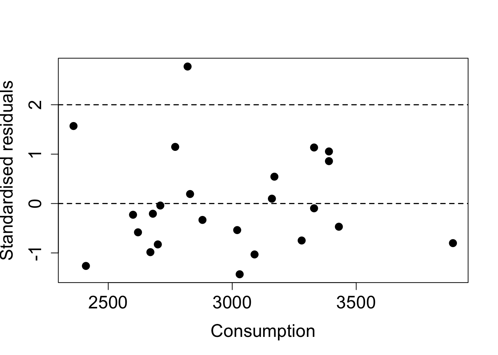
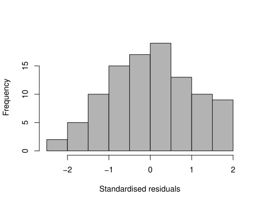
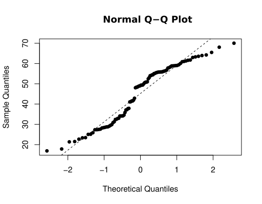
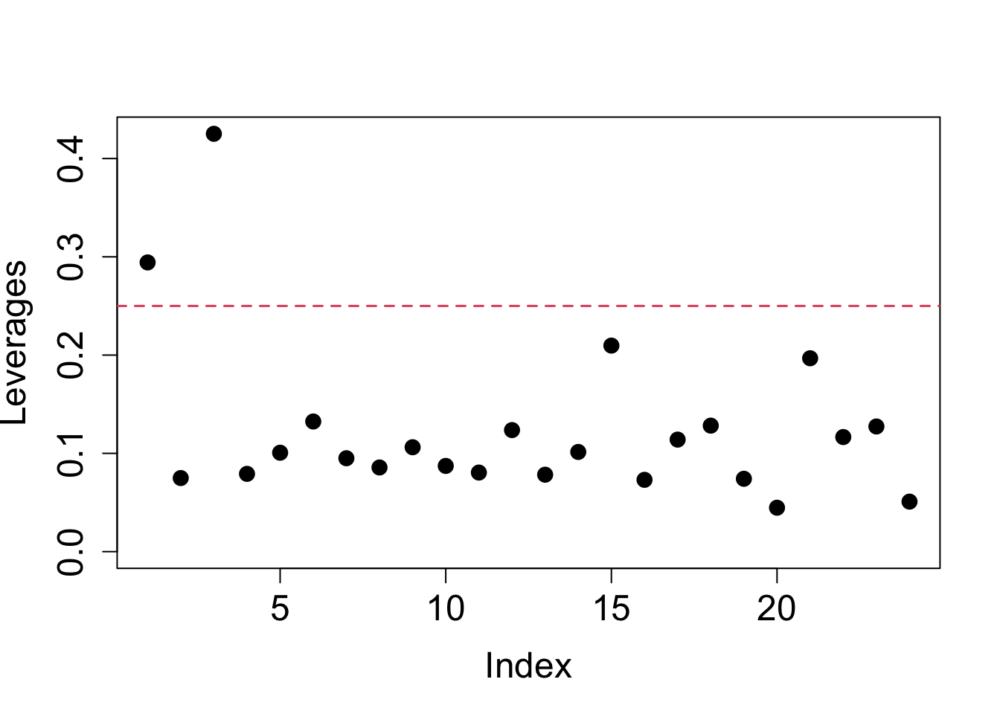
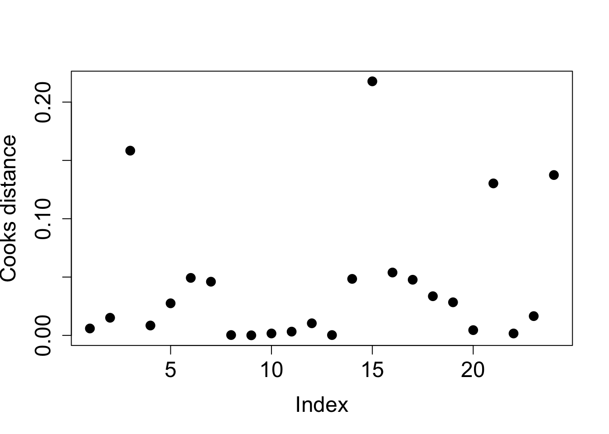
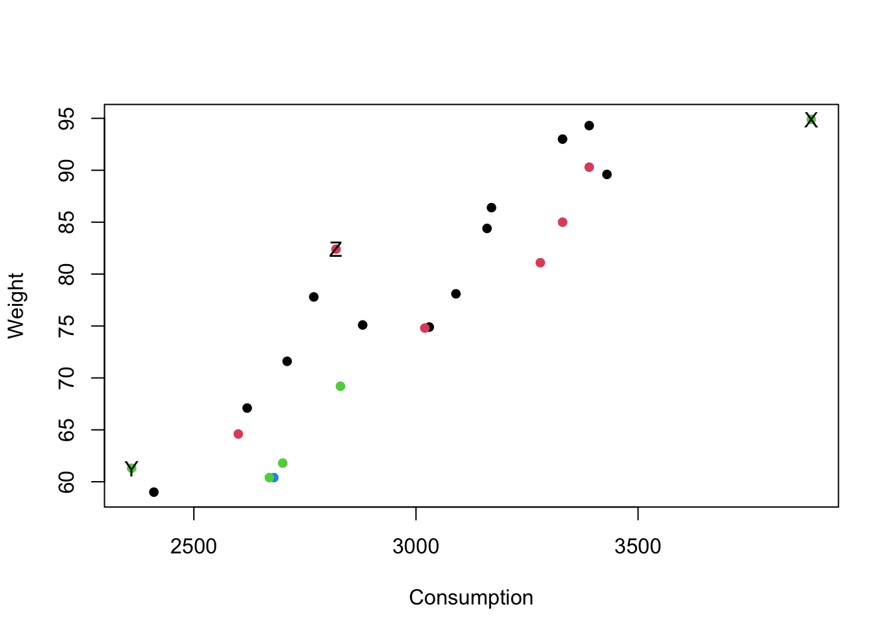
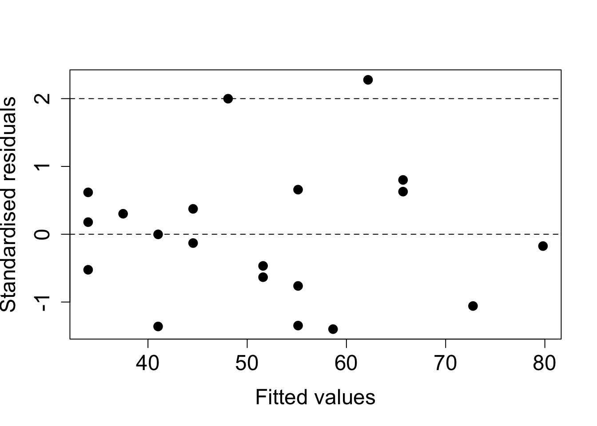
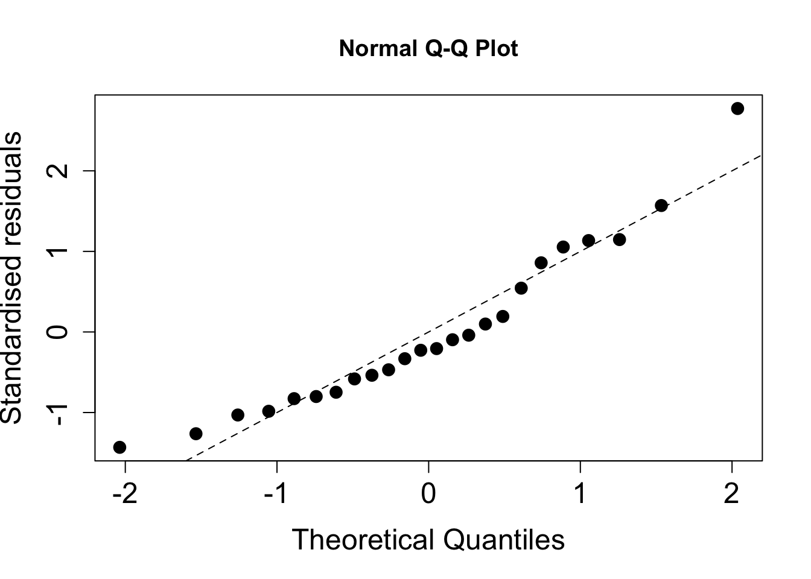

# Regression diagnostics

Chapter 1 introduced the multiple linear regression model, how to estimate the parameters and some properties of the estimators, amongst other things. We now consider the situation where, having fitted a model (or several candidate models), we wish to assess the validity of the model(s). Recall that when defining the multiple linear regression model we made a series of assumptions, which, in turn, allowed us to use maximum likelihood to estimate the parameters. In this chapter we describe a suite of methods that can be used to check if our model conforms to the assumptions. Namely, we can consider whether

<ol type="i">
<li> the relationship between $Y$ and the $x$-variables is linear; </li>
<li> the errors are normally distributed; </li>
<li> the errors are uncorrelated; </li>
<li> the error term, $\epsilon_i$, has constant variance $\sigma_{\epsilon}^2$; </li> </ol>
Additionally, we will investigate whether any points
<ol type="i" start="5">
<li> are unusual (outliers)
</li>
<li> have a large effect on the regression coefficients (via their leverage). </li>
<li> are unduly influential (via their Cook's distance); </li>
</ol>

You may have encountered some of these before. In the previous chapter, we informally assessed the assumption of a linear relationship through a scatterplot, or a series of pairwise scatterplots when we have more than one covariate. However, when there are many covariates (and particularly if some of these are categorical or ordinal) this can become an unwieldy approach. 

Moreover, the underlying linear (or otherwise) relationship can be masked by the relationship of the response with the other variables; the residuals, however, are adjusted for this. As such, it is recommended to use residual checks to verify the functional form of the model, i.e. are the relationships linear? Happily, the residuals also allow us to check the remaining assumptions too, since they are our estimate of the true (but unknown) errors. 

## Standardised residuals
Recall, from section \@ref(sec:resfithat), that the residual is the observed value minus the fitted value. Its definition and variance are given by
\begin{align*}
\color{red}{\vec{\hat{\epsilon}}} &\color{red}{= \vec{y} - \vec{\hat{y}}} \\
&\color{red}{= (\up{I} - \up{H})\vec{y}}
\end{align*}
and
\[
\color{red}{\Var\left(\vec{\hat{\epsilon}}\right) = (\up{I} - \up{H})\sigma_{\epsilon}^2.}
\]

We might also like to think about the residuals and fitted values at the observation level, particularly if we are looking at observations that are unusual. Based on the above we have
\[
\color{red}{\hat{\epsilon}_i = y_i - \hat{y}_i}
\]
and
\[
\color{red}{\Var(\hat{\epsilon}_i) = (1 - h_{ii})\sigma_{\epsilon}^2}
\]
respectively, for $i = 1, \ldots, n$. 

Note that this informs us that the variance is not the same for each residual, since the $h_{ii}$ values will (typically) be different for each $i$. Furthermore, the raw residuals are not scale invariant, so changing the unit of measurement would drastically affect the residuals, and the threshold for a large residual depends on the context at hand. 

For instance, on data with populations measured in millions we would expect large residuals even in a well-behaved model, whereas in water treatment, or air quality, measurements are often made which amount to microscopic quantities (typically measured in parts per million) that would lead to miniscule residuals, even if the underlying model is poor.

To get around these issues, we work with the *standardised* residuals
\[
\color{red}{\hat{e}_i = \frac{\hat{\epsilon}_i}{\sqrt{(1 - h_{ii})s^2}}}
\]

where $s^2$ is our estimate of $\sigma_{\epsilon}^2$ (see Chapter 1). The standardised residuals have a mean of zero (as do the raw residuals) since their sum is constrained to be zero - which induces dependence - and a variance of (approximately) one. Placing the residuals on a common scale also allows us to look for outliers or unusual observations more easily (see later). We can calculate the standardised residuals in `R` using the following command, where `fit2` is our second fitted model from chapter 1:


``` r
rstandard(fit2)
```

```
##           1           2           3           4           5           6 
## -0.20643768 -0.74827738 -0.80142866  0.54358256  0.85837659 -0.98421544 
##           7           8           9          10          11          12 
##  1.14666224 -0.09647632 -0.04022545 -0.22714152 -0.33189908 -0.46936793 
##          13          14          15          16          17          18 
##  0.09836234  1.13448521  1.56936911 -1.43201467  1.05443091 -0.82758724 
##          19          20          21          22          23          24 
## -1.03068909 -0.53747090 -1.26308890  0.19268170 -0.58264176  2.77358349
```

We use the terminology of standardised residuals in this module since this is what is adopted in `R`. You may sometimes see the phrase '(internally) studentised' residuals elsewhere (in MAS2902 for instance) for this same concept. There is also, as you might expect, an externally studentised residual, but this is not explored further here.

### Residual plots
We typically use visual inspection (i.e. plots) to check the model assumptions since the raw values themselves are hard to interpret. We primarily plot $\hat{e}_i$ against the fitted values $\hat{y_i}$, and they can also be plotted against each of the explanatory variables in order to verify the functional form. If the model assumptions are satisfied, then, for each plot, the standardised residuals should be randomly scattered within a horizontal band: 


Otherwise, we could get signs of non-constant variance, i.e. increasing, double bow, decreasing, or signs of non-linearity (see practical 2). In practice, nonlinearity is hard to distinguish from correlation in the standardised residuals. Some examples of residuals not conforming to model assumptions are given above.

### Correlation between residuals and fitted values {-}
The reason we plot residuals against fitted values, rather than the observations themselves is because the residuals and fitted values are *uncorrelated*. This allows us to detect any unusual observations without worrying that these may be due to an underlying dependence between the quantities being plotted.

#### Proof {-}
\begin{align*}
\color{red}{\Cov(\vec{e}, \vec{\hat{Y}})} &\color{red}{= \Cov(\vec{Y} - \vec{\hat{Y}}, \vec{\hat{Y}})} \\
&\color{red}{= \Cov(\left\{\up{I} - \up{H}\right\}\vec{Y},  \vec{\hat{Y}})} \\
&\color{red}{=  \Cov(\left\{\up{I} - \up{H}\right\}\vec{Y},  \up{H}\vec{Y})} \\
&\color{red}{= (\up{I} - \up{H})\Cov(\vec{Y}, \vec{Y})\up{H}^T} \\
&\color{red}{= (\up{I} - \up{H})\Var(\vec{Y})\up{H}^T} \\
&\color{red}{= (\up{I} - \up{H})\sigma_{\epsilon}^2\up{I}\up{H}^T} \\
&\color{red}{= \sigma_{\epsilon}^2 (\up{I} - \up{H}) \up{H}^T} \\
&\color{red}{=  \sigma_{\epsilon}^2 (\up{I} - \up{H})\up{H}} \\
&\color{red}{= \sigma_{\epsilon}^2(\up{H} - \up{H}^2)} \\
&\color{red}{= \sigma_{\epsilon}^2 (\up{H} - \up{H})} \\
&\color{red}{= \vec{0}}
\end{align*}

This result also hold for the standardised residuals and the fitted values, but the proof is more convoluted; the residuals and the observed values, however, are not independent.

### Outliers
*Outliers* are points which appear separated in some way from the remainder of the data. Part of the purpose of our residual plots is to check for unusual observations. The standardised residuals give a good initial indicator of outliers. If we assume the (raw) residuals are normally distributed (we will check this assumption shortly), then the standardised residuals are also normal, albeit with a different variance, which is close to one (see above). 

Hence, the standardised residuals are assumed to be approximately *standard* normal, and this suggests that values outside the range $\pm 2$ are indicative of outliers. However, by normal distribution theory, we expect around $5\%$ of observations to be outside this range by chance - recall that $\pm 1.96$ cuts off $2.5\%$ of a standard normal distribution, i.e. $Pr(Z > 1.96) = 0.025$, where $Z \sim N(0, 1)$. This value is often rounded to $\pm 2$ to act as a simple rule-of-thumb for residual plots. Clearly, the larger the absolute value of the standardised residual the more likely it is to be an outlier.

Note that it is not reasonable to remove outliers just because we don't like the look of them! It is, of course, worth checking the original source of the data - if the outliers are a result of recording error, then this should be corrected. If the outliers appear genuine, we should see how discrepant they are. We can carry out an analysis with and without the suspect observations to investigate the sensitivity of the results.

### Example: Residual analysis for pre-diabetes data {-}
Residual plots for the pre-diabetes data can be generated in `R` using the following commands:

#### Standardised residuals against covariates {-}

``` r
plot(bodyweight$Consumption, rstandard(fit2), 
     xlab = "Consumption", ylab ="Standardised residuals")
abline(h = c(-2, 0, 2), lty = 2) 
```

<div class="figure" style="text-align: center">

<p class="caption">(\#fig:unnamed-chunk-4)Scatterplot of standardised residuals against (average) food consumption for the pre-diabetes data.</p>
</div>


``` r
plot(bodyweight$Exercise, rstandard(fit2), 
     xlab = "Exercise", ylab ="Standardised residuals")
abline(h = c(-2, 0, 2), lty = 2) 
```

<div class="figure" style="text-align: center">

<p class="caption">(\#fig:unnamed-chunk-6)Scatterplot of standardised residuals against (average) food consumption for the pre-diabetes data.</p>
</div>


#### Standardised residuals against fitted values {-}

``` r
plot(fitted.values(fit2), rstandard(fit2), 
     xlab = "Fitted values", ylab ="Standardised residuals")
abline(h = c(-2, 0, 2), lty = 2) 
```

<div class="figure" style="text-align: center">

<p class="caption">(\#fig:unnamed-chunk-8)Scatterplot of standardised residuals against fitted values for the multiple linear regession model with consumption and exercise.</p>
</div>

In each of the above plots, we have added a dashed horizontal line at zero to help look for patterns, we would expect around half of the standardised residuals to lie both above and below the line in each case. Further dashed lines at $\pm 2$ allow us to identify how many points lie outside these bounds (recall, we expect $\approx 5\%$ in a well-behaved model).

To summarise these plots we can say:

<span style="color: red;">- there is no clear pattern in the residuals although there is a (mild) suggestion of curvature in the plot against exercise.</span>

<span style="color: red;"> - the variance does not appear to change in a systematic way.</span>

<span style="color: red;">- there is one point with a standardised residual greater than 2 in modulus. Possible outlier? We expect about $5\%$ to be in this range, i.e. 1 in a sample size of 24.</span>

<span style="color: red;">Thus there is no clear evidence of a departure from our assumptions.</span>

Note that when solely discrete (or ordinal) variable(s) are included in the model, the residual plot appears as strips of points at the observed values for the covariate. This is to be expected! We can still assess variability by checking whether the length of the strip is roughly the same and that it is centred around zero.

### Normality of the residuals
As mentioned earlier, analysis of the multiple linear regression model hinges on assumptions of normality (and independence) of the errors; you will consider models that deviate from this assumption in semester two. Hence, we need to check this assumption after fitting a model as the consequences of non-normality of the residuals are:

- the least squares estimates, $\vec{\hat{\beta}}$, may not be optimal;

- the associated tests and confidence intervals are inaccurate.

However, it has been shown that only really long-tailed distributions cause a major problem and that mild non-normality can safely be ignored. Furthermore, the larger the sample size the more the the non-normality is the more the consequences are mitigated. To get the normality plot for the pre-diabetes data, we use the following commands:


``` r
qqnorm(rstandard(fit2), ylab = "Standardised residuals")
abline(a = 0, b = 1, lty = 2)
```

<div class="figure" style="text-align: center">

<p class="caption">(\#fig:unnamed-chunk-10)Normality plot of standardised residuals.</p>
</div>

As before, for the `R` code to work we must have previously defined the object `fit2`. 

Comment: The standardised residuals fit fairly well to a straight line but are being partially distorted by the potential outlier. Successive observations in the plot are not independent and so `ripples' often occur by chance.

### Anderson-Darling test
Visual inspection of residual plots is a useful way to see where any departures from our assumptions may lie. However, it may also be good to have a summary measure via a formal statistical test to assess where there is a significant departure from normality. The most commonly used statistic is the *Anderson-Darling* (AD) statistic - `R` outputs the test statistic and a p-value when carrying out an AD test. The null hypotheses is that the residuals can reasonably be assumed to come from a normal distribution, with the alternative hypothesis stating the converse. As such, large p-values imply the normality assumption is fine, small p-values imply a significant departure from normality.

Comment: Note that there are some issues with the AD test for large sample sizes as it is very sensitive to outliers. From above, we know that our model is reasonably robust to outliers so we should be careful not to over-interpret an AD test if the plots pass a visual check.

##### Anderson-Darling test in `R` {-}
To carry out an AD test in `R` we first need to load the library `nortest`. For the pre-diabetes example:

``` r
library(nortest)
ad.test(rstandard(fit2))
```

```
## 
## 	Anderson-Darling normality test
## 
## data:  rstandard(fit2)
## A = 0.53928, p-value = 0.1494
```

As the p-value is fairly large in this case, we do not have a significant departure from normality and conclude that the assumption is not disputed for this model.

### A cautionary note {-}
One of the assumptions of the model is that the true (but unknown) errors, $\vec{\epsilon}$, follow a normal distribution. We assess this using the estimated errors, i.e. the residuals. The assumed normality of the errors also induces normality on the response, but this is conditional on the values of the covariates, namely $Y_i \mid \vec{x}_i, \vec{\beta}, \sigma_{\epsilon}^2 \sim N(\vec{x}_i^T \vec{\beta}, \sigma_{\epsilon}^2)$. As such we cannot judge the normality assumption on plots of the response variable alone - even though it may be tempting or even feel intuitive to do so - without taking into account the values of the covariates. This can be awkward to construct whereas a residual check is straightforward (and will show the same thing).

Consider a multiple linear regression model with one continuous covariate ($x_1$) and one binary covariate ($x_2$), such as a treatment arm in a trial. If there are considerable differences between the two treatment groups then this will induce a bimodal distribution on the (unconditional) response variable, $\vec{Y}$:


However, if we then fit a multiple linear regression model and look at the (standardised) residuals we see an approximate normal distribution



Similarly, we can inspect quantile-quantile plots of both the response (upper plot) and the (standardised) residuals (lower plot).



We observe that the upper plot does not conform to a straight line relationship whereas the right-hand one does. Note in passing that an AD test gives $p < 0.001$ (reject $H_0$) for the response variable and $p > 0.10$ (retain $H_0$) for the residuals.

## Regression diagnostics
As well as a raft of residual checks, two other metrics are commonly used to check the fit of a regression model - leverage and influence. We first consider leverage.

### Leverage values
An observation with an extreme value in the $x$-space (explanatory variables) is called a point with high leverage. Leverage is a measure of how far the explanatory variables deviate from their mean. Recall that the hat matrix, $\up{H}$ is defined as

\[
\color{red}{\up{H} = \up{X}(\up{X}^T\up{X})^{-1}\up{X}^T}
\]

High leverage points can have an unusually large effect on the estimates of regression coefficients. To detect high leverage points we look for large values of $h_{ii}$, the diagonal elements of $\up{H}$, which are known as the *leverages*. Note that the leverage values depend on the covariates alone, and not on the response variable. 

If the value of $h_{ii}$ is large, then $\Var[\hat{\epsilon}_i]$  will be small, i.e. the fit will be close to $Y_i$, since $\Var[\hat{\epsilon}_i] = (1 - h_{ii})\sigma_{\epsilon}^2$ and this will approach zero as the hat values get close to unity. This means that the regression line is `forced' to fit well to points with a large leverage value so these points have the potential to severely alter the gradient of the regression line. A consequence of this is that the variance of $\hat{Y_i}$, which is given by $h_{ii}\sigma_{\epsilon}^2$, will be at its largest for points of high leverage. The sketches below demonstrate this.


#### Properties of the leverage values {-}
1. The leverages are bounded between 0 and 1, i.e. $0 \leq h_{ii} \leq 1$
1. The sum of the leverages is equal to the number of parameters in the model (including the intercept), i.e. $\Sigma_{i=1}^n h_{ii} = p+1$

##### Derivation {-}
<span style="color: red;">We will focus on the second property only. Recall that the trace of a (symmetric) matrix is the sum of the diagonal elements. Now,</span>

\begin{align*}
\color{red}{\Sigma_{i=1}^n h_{ii}} & \color{red}{= \tr(\up{H})} \\
&\color{red}{= \tr\left(\up{X}(\up{X^T X})^{-1}\up{X}^T\right)} \\
&\color{red}{= \tr\left(\up{X}^T\up{X}(\up{X^T X})^{-1}\right)} \\
&\color{red}{= \tr(\up{I}_{p+1})} \\
&\color{red}{= p + 1.}
\end{align*}

Usually, a value of $h_{ii} > 2(p + 1)/n$ is regarded as indicating a point of high leverage, where $p$ is the number of explanatory variables in the model. Note that the leverage values depend on the $x$-variables alone, and not on the response variable.

### Example: Leverage values for the pre-diabetes data {-}
As for the residual checks, we typically plot the leverage values to look for large values. This can be achieved in `R` via the following commands:


``` r
plot(hatvalues(fit2), ylab ="Leverages", pch = 16)
abline(h = 2*3/24 , col = 2, lty = 2)
```

<div class="figure" style="text-align: center">

<p class="caption">(\#fig:levsplot1)Leverage values from mutliple linear regression model for pre-diabetes data.</p>
</div>

Note that $p = 2$ here (and $n = 24$) since we have two explanatory variables: consumption and exercise. From the plot, we can identify that there are two points of high leverage here. For large datasets, it may be more prudent to use `R` to find out how many points exceed the threshold


``` r
table(hatvalues(fit2) > 2*3/24)
```

```
## 
## FALSE  TRUE 
##    22     2
```

If any points are flagged we can identify them using


``` r
levs <- hatvalues(fit2)
levs[levs > 2*3/24]
```

```
##         1         3 
## 0.2942944 0.4251701
```

This tells us that it is points 1 and 3 in this case.

### Influential observations
Some points have more influence on the regression analysis than others. These are not necessarily clear outliers or points of high leverage, but are typically fairly large in both regards. One approach for detecting such observations is using Cook's distance, which is defined by:

\[
\color{red}{D_i = \frac{1}{p+1}(\hat{e}_i)^2 \frac{h_{ii}}{1 - h_{ii}}}
\]

for $i = 1, \ldots, n$, and $\hat{e}_i$ and $h_{ii}$ are the standardised residual and leverage values respectively defined earlier. Although not clear from the formula, Cook's distance is a measure of how much the fitted values in the model would change if the $i^{th}$ data point was deleted.

Large values of $D_i$ indicate that the point has a large influence on the model. We can calculate and plot the Cook's distances in `R` using:


``` r
plot(cooks.distance(fit2), ylab = "Cooks distance", pch = 16)
```

<div class="figure" style="text-align: center">

<p class="caption">(\#fig:cooksplot1)Cook distances from mutliple linear regression model for pre-diabetes data.</p>
</div>

There is no agreed threshold to identify influential observations, unlike for points of high leverage. However, a value of 1 has been suggested but this is typically conservative. A pragmatic approach is to investigate any (groups of) observations that appear to have larger values than the others. In our example, taking a threshold of 0.10 appears sensible.


``` r
cooks <- cooks.distance(fit2)
cooks[cooks > 0.10]
```

```
##         3        15        21        24 
## 0.1583550 0.2177828 0.1302879 0.1374646
```

We see that point 15 has the largest Cook’s distance, then point 3, and then point 24. Point 24 was the point with the largest absolute value of the standardised residuals; 3 was the point with the highest leverage. Observation 15 has the second largest absolute value of the standardised residuals, and the third highest leverage.

### Dealing with unusual observations
What should we do with the influential and/or high leverage points? As a first pass, we should check that they have been entered correctly, either by ourselves or by a data clerk or external source, but this may not be possible. Visually, we can plot the data with them highlighted and check whether they stand out. Can they be explained? The following `R` code produces such a plot for our example, where we have highlighted points 3 (highest leverage), 15 (largest Cook's distance) and 24 (large outlier) as X, Y and Z respectively. We also colour-code points by exercise (1 is black, 2 is red, 3 is green): 

<div class="figure" style="text-align: center">

<p class="caption">(\#fig:label_inf_plot1)Scatterplot for pre-diabetes data with unusual points identified.</p>
</div>


``` r
# Or in one command
points(bodyweight[c(3, 15, 24), 2:1], pch  = c("X", "Y", "Z"))
```

We see that the point with the highest leverage (point 3, X) has an unusually large value for consumption. Point 24 (Z) - the possible outlier - does not look that unusual, being central in the consumption range, albeit with a higher value for weight than we might expect. Point 15 (Y), with the largest Cook’s distance, has the lowest consumption and a high weight value for that group (the green points). We could remove the most influential point and re-fit the model, but it does not change the results much here (this is left as an exercise).

### Example: Model checking for the Premier League data {-}
We now return to Example 1.10 from chapter 1 and carry out the full suite of checks (i.e. outliers, points of high leverage/influence and a normality test) on the model for points scored using clean sheets as the single (mean-centered) covariate.

To recap, the call to fit the model (after mean-centering the variable) was


``` r
CleanSheetsScaled <- scale(prem$CleanSheets, scale = FALSE)
fit_mean_centre <- lm(Points ~ CleanSheetsScaled, data = prem)
```

A scatterplot of the original data, with the line of best fit superimposed, is included below, with each point labelled by final league position, from 1 (top) to 20 (bottom):


<ol type="a">
<li> Interpret the plot of the (standardised) residuals.
</li>
<div class="figure" style="text-align: center">

<p class="caption">(\#fig:unnamed-chunk-22)Plot of standardised residuals against fitted values.</p>
</div>

<span style="color: red;">- All but one of the residuals lies in $(-2, 2)$, and we would expect one by chance in this dataset of twenty observations.</span> 

<span style="color: red;">- There is no discernible pattern to the (standardised) residuals with random scatter within our horizontal band, with no evidence of nonlinearity or non constant variance.</span>

<li> Assess the normality assumption of the residuals and interpret the output of the Anderson-Darling test.
</li>

<div class="figure" style="text-align: center">

<p class="caption">(\#fig:unnamed-chunk-23)Normality plot of standardised residuals.</p>
</div>


``` r
ad.test(rstandard(fit_mean_centre)) # See Chapter 1
```

```
## 
## 	Anderson-Darling normality test
## 
## data:  rstandard(fit_mean_centre)
## A = 0.33253, p-value = 0.4807
```

<span style="color: red;">- From the plot, the points lie close to the nominal 45 degree line.</span>

<span style="color: red;">- Due to the correlation between (standardised) residuals we expect to see `bumps' or `ripples' and this does not invalidate the normality assumption.</span>

<span style="color: red;">- For the AD test, the p-value is not significant at any conventional level so we retain the null hypothesis that the (standardised) residuals can be assumed to be normally distributed.</span>

<li> Use regression diagnostics to identify any points of high leverage, or of high influence.
</li>
<div class="figure" style="text-align: center">

<p class="caption">(\#fig:unnamed-chunk-25)Plot of leverages (left) and Cook distances (right) indexed by final league position.</p>
</div>

<span style="color: red;">The leverage values are plotted on the left, and the Cook's distances on the right. We can see one point above the threshold (dashed line) for the leverages (which is $2\times 2/20 = 0.20$ here). This corresponds to observation 2. On inspection of the original data, we see that this is the team (Manchester City) with the most clean sheets, so is large in $x$ space, thus having the capacity to alter the regression line.</span>


<span style="color: red;">For the influential points, we see that the largest is for observation 1. This point lies a considerable distance from the regression line, our model would expect fewer points based on this covariate value. Other covariates may be needed in the model. The next largest Cook's distances (points 5 and 7) are not that much larger than the body of the points so we do not consider them further, apart from observing that they deviate the most from the fitted line (for point 5 it is above the line of best fit, for point 7 it is below).</span>

</ol>
