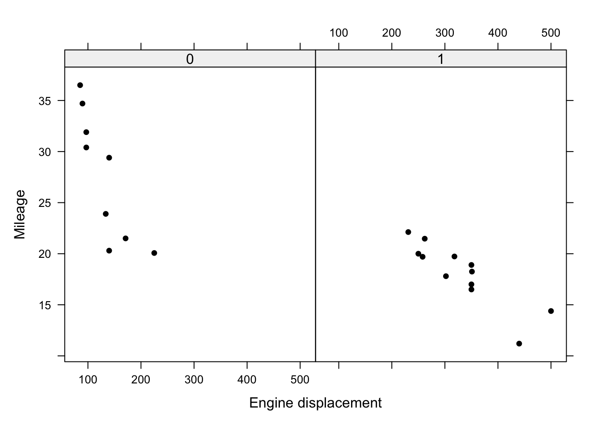
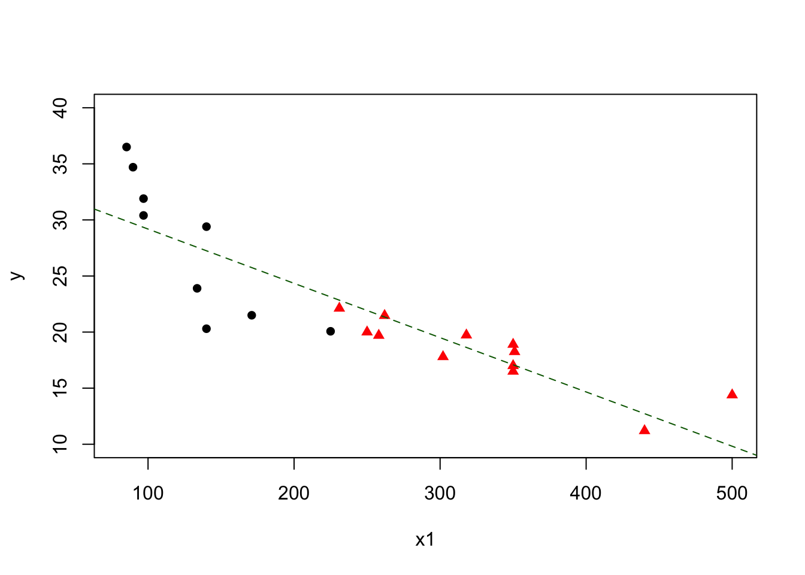
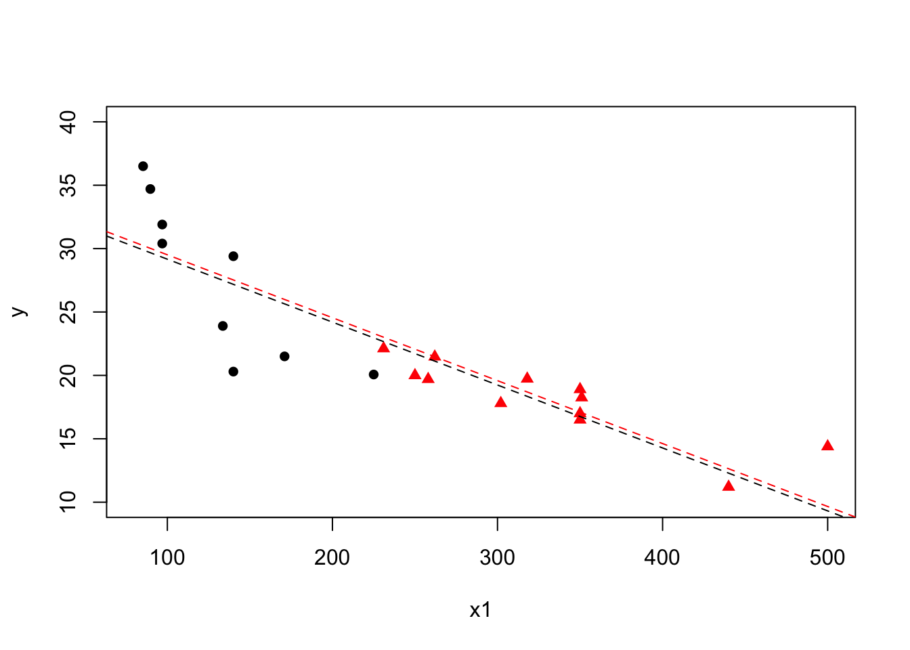
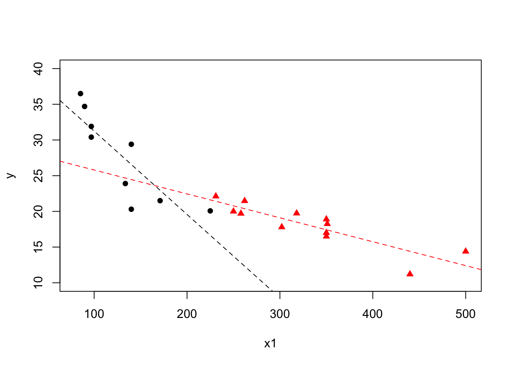

# General linear models

In the models considered thus far, we have had exclusively continuous covariates (multiple linear regression models) In reality, we are often faced with both continuous and categorical variables within the same dataset. Both of these models actually fall under the umbrella term of a *general linear model*, as do many more. We will now consider a model of this mixed type. Models with exclusively categorical variables (known as *factors*) will be the subject of the next chapter.

## Indicator and dummy variables
Let us consider an example where there appeared to be a linear relationship between weight and length in both male and female lobsters. However we may want to consider:

1. Is there a difference in the intercepts between males and females?
1. Is there a difference in the slopes?

We can thus define an indicator variable which indicates the sex of the lobster. Let $x_1 = 0$ for a male and $x_1 = 1$ for a female, i.e.

\[
\color{red}{x_{1} = \begin{cases} 1& \text{if `Female`} \\
0& \text{if `Male`}
\end{cases}}
\]

<!-- <span style="color:red;">$x_{1} = \begin{cases} 1& \text{if ``Female''} \\ 0& \text{if ``Male''}\end{cases}$</span> -->

This can also be written as $I(x_1 = \text{`Female`})$, where $I()$ is an indicator variable, taking the value 1 if the condition i parentheses is true, and zero otherwise. An indicator always takes the values 0 or 1, to indicate the absence or presence of a particular characteristic (here the characteristic is 'female').

If all the regressor variables are indicator variables, then we are actually dealing with anova models (as we will see in Chapter 5); if some of the regressor variables are indicator variables, then we have analysis of covariance (ancova) models. Our first example of using indicator variables will be to fit two simple linear regression equations simultaneously. Consider the model:

\[
Y = \beta_0 + \beta_1 x_1 + \beta_2 x_2 + \epsilon
\]

where $x_1$ is an indicator variable and $x_2$ is a quantitative variable. Then

1. <span style="color: red;">$\E(Y \mid x_1 = 0) = \beta_0 + \beta_2 x_2$, and </span>
1. <span style="color: red;">$\E(Y \mid x_1 = 1) = (\beta_0 + \beta_1) + \beta_2 x_2$ </span>

So what we are really doing is fitting two regression lines with a common slope, i.e. two parallel lines. The lines are separated in the vertical plane by the value of $\beta_1$. Hence, if this value is close to zero then one line will suffice. Formally, we can test for a common intercept by testing 

\[
\color{red}{H_0: \beta_1 = 0 \;\;\text{versus}\;\; H_1: \beta_1 \neq 0}
\]

in the usual way (i.e. we are testing for a common line, which corresponds to no difference between the two categories). To fit two lines with different slopes, we fit:

\[
\color{red}{Y = \beta_0 + \beta_1 x_1 + \beta_2 x_2 + \beta_3 x_1 x_2 + \epsilon}
\]

Under this formulation

1.  <span style="color: red;">$\E(Y \mid x_1 = 0) = \beta_0 + \beta_2 x_2$ </span>
1.  <span style="color: red;">$\E(Y \mid x_1 = 1) = (\beta_0 + \beta_1) + (\beta_2 + \beta_3) x_2$ </span>

This is an interaction model! We can test for a common slope via
\[
\color{red}{H_0: \beta_3 = 0 \;\;\text{versus}\;\; H_1: \beta_3 \neq 0.}
\]

## Example: Gasoline data {-}
The data in the file *gasoline.RData* gives the gasoline mileage ($y$), the engine displacement ($x_1$) and the type of transmission ($x_2$) for a sample of cars, where $x_2$ is coded as 0 for automatic transmission and 1 for manual transmission.

We begin by plotting the data. We can use the command `xyplot()` to produce an appropriate plot (although `plot()` can also be used with different symbols for each factor level).

<div class="figure" style="text-align: center">

<p class="caption">(\#fig:gasolinexyplot)Plot of mileage against engine displacement by transmission type.</p>
</div>

There is a clear difference in the intercepts with most automatic transmission points above manual transmission points.  Mileage declines with engine displacement, and it looks like the rate of decline may be different for the two transmission types. In particular, there looks to be a steeper decline for cars with automatic transmission. Let us see what happens if we fit a common line, i.e. ignore transmission type. 


``` r
m1 = lm(y ~ x1, data = gasoline)
summary(m1)
```

```
## 
## Call:
## lm(formula = y ~ x1, data = gasoline)
## 
## Residuals:
##     Min      1Q  Median      3Q     Max 
## -6.9498 -1.8377 -0.0842  1.8158  6.6023 
## 
## Coefficients:
##              Estimate Std. Error t value Pr(>|t|)    
## (Intercept) 34.026933   1.674994  20.315 2.40e-14 ***
## x1          -0.048408   0.006168  -7.848 2.22e-07 ***
## ---
## Signif. codes:  0 '***' 0.001 '**' 0.01 '*' 0.05 '.' 0.1 ' ' 1
## 
## Residual standard error: 3.324 on 19 degrees of freedom
## Multiple R-squared:  0.7643,	Adjusted R-squared:  0.7519 
## F-statistic:  61.6 on 1 and 19 DF,  p-value: 2.224e-07
```

Comments: <br>
<span style="color: red;">- We can see that engine displacement gives a very small $p$-value , suggesting that this is very important. <br>
- However, we have ignored the crucial information on transmission type, and this can give misleading conclusions. </span>

We can add the fitted line to the raw data using `abline(m1)`:

<div class="figure" style="text-align: center">

<p class="caption">(\#fig:gasolinefitplot)Plot of mileage against engine displacement by transmission type with line of best fit overlaid.</p>
</div>

We can see that the line captures that there is a decline with engine displacement. However, it does not fit the data well, particularly for automatic transmission cars, because we have ignored transmission type. We will now add in the transmission type, allowing a test of

\[
\color{red}{H_0: \beta_2 = 0 \;\;\text{versus}\;\; H_1: \beta_2 \neq 0}
\]

We use the `R` commands


``` r
m2 = lm(y ~ x1 + x2, data = gasoline)
summary(m2)
```

```
## 
## Call:
## lm(formula = y ~ x1 + x2, data = gasoline)
## 
## Residuals:
##    Min     1Q Median     3Q    Max 
## -6.880 -1.970 -0.104  1.796  6.605 
## 
## Coefficients:
##             Estimate Std. Error t value Pr(>|t|)    
## (Intercept) 34.12798    1.89989  17.963  6.1e-13 ***
## x1          -0.04963    0.01162  -4.271  0.00046 ***
## x21          0.34592    2.76144   0.125  0.90170    
## ---
## Signif. codes:  0 '***' 0.001 '**' 0.01 '*' 0.05 '.' 0.1 ' ' 1
## 
## Residual standard error: 3.414 on 18 degrees of freedom
## Multiple R-squared:  0.7645,	Adjusted R-squared:  0.7383 
## F-statistic: 29.21 on 2 and 18 DF,  p-value: 2.231e-06
```

We observe that the addition of the transmission type indicator variable is not significant, and $R^2$ has not changed much either. Perhaps a common slope is a plausible claim?

<div class="figure" style="text-align: center">

<p class="caption">(\#fig:gasolinefitplot2)Plot of mileage against engine displacement by transmission type with lines of best fit for each transmission type overlaid (automatic - black, manual - red).</p>
</div>

Are we overlooking something? What about the gradients? We now fit a model with different intercepts *and* different slopes

\[
\color{red}{H_0: \beta_3 = 0 \;\;\text{versus}\;\; H_1: \beta_3 \neq 0}
\]


``` r
m3 = lm(y ~ x1 + x2 + x1:x2, data = gasoline)
summary(m3)
```

```
## 
## Call:
## lm(formula = y ~ x1 + x2 + x1:x2, data = gasoline)
## 
## Residuals:
##     Min      1Q  Median      3Q     Max 
## -6.2712 -1.2042  0.2958  1.4758  3.5412 
## 
## Coefficients:
##              Estimate Std. Error t value Pr(>|t|)    
## (Intercept)  42.91963    2.78705  15.400 2.04e-11 ***
## x1           -0.11677    0.02022  -5.776 2.24e-05 ***
## x21         -13.77463    4.36449  -3.156  0.00577 ** 
## x1:x21        0.08329    0.02252   3.699  0.00178 ** 
## ---
## Signif. codes:  0 '***' 0.001 '**' 0.01 '*' 0.05 '.' 0.1 ' ' 1
## 
## Residual standard error: 2.615 on 17 degrees of freedom
## Multiple R-squared:  0.8695,	Adjusted R-squared:  0.8465 
## F-statistic: 37.75 on 3 and 17 DF,  p-value: 9.809e-08
```

We see that the $p$-value for the interaction is significant beyond the $1\%$ level, suggesting the slopes are different and $\beta_3 \neq 0$. Furthermore, we also see that the main effect of the transmission type is also now significant (also at the $1\%$ level). The conclusion for engine displacement is largely as before, with a significant (and negative) coefficient although the magnitude has now changed. $R^2$ has increased to around $87\%$, indicating that this model captures more of the uncertainty in mileage. 

These results highlight the need to always include all lower order terms up-to-and-including the highest order term. Adding the respective lines of best fit to the raw data now gives:

<div class="figure" style="text-align: center">

<p class="caption">(\#fig:gasolinefitplot3)Plot of mileage against engine displacement by transmission type with lines of best fit for each transmission type overlaid (automatic - black, manual - red) from interaction model.</p>
</div>

This is clearly a much better fit. Note the crossing lines, which are indicative of an interaction. Now that we are happier with our model we should carry out the usual residual checks (not included here).

### Model interpretation {-}
The final model is:

\begin{align*}
\color{red}{\text{Mileage} = 42.92} &\color{red}{- 0.12\times\text{Engine displacement}} \\
&\color{red}{- 13.77 \times I(\text{Transmission type} = 1)} \\
&\color{red}{+ 0.08\times \text{Engine displacement} \times I(\text{Transmission type} = 1)}
\end{align*}

This can be expressed as two separate models:

\begin{align*}
\color{red}{\text{Type 0: Mileage}} &\color{red}{= 42.92 - 0.12\times \text{Engine displacement}} \\
\color{red}{\text{Type 1: Mileage}} &\color{red}{= 29.15 - 0.04\times \text{Engine displacement}}
\end{align*}

Overall it can be seen that the mileage decreases by 0.12 for every unit increase in engine displacement when the transmission is automatic, and by 0.04 units when the transmission is manual.  The decrease is greater when the transmission is automatic, as we would expect based on our initial plot. The effect of engine displacement differs according to the transmission type and two non-parallel lines must be used to model the data.

## Model selection criteria
Recall $R^2 = \text{RSS}/\text{TSS}$, is the coefficient of determination, i.e. the proportion of the total (corrected) sum of squares of the response $Y$ explained by the model. The aim is to select a model that accounts for as much of this variation as is practical, i.e. we would like to only include regressors that are useful in some sense. 

However, $R^2$ cannot decrease as regressor variables are added to the model. Thus the maximum $R^2$ will always be the model that contains all the regressor variables. As more regressors are added $R^2$ increases, but 'tails off'. Thus, we could choose $k$ (the number of regressors to include) at the 'elbow'. In addition, some alternative measures exist which can be minimised or maximised directly, removing some of the subjective issues based around using $R^2$ alone.

### Model selection criteria: adjusted $R^2$
The adjusted coefficient of determination is defined as

\[
\color{red}{R^2_{\text{adj}} = 1 - \frac{\text{RMS}}{\text{TMS}}}
\]

where $\text{RMS}$ is the residual mean square error and $\text{TMS}$ is the total mean square error. This approach rescales $R^2$ using the degrees of freedom. Assuming we have $k$ degrees of freedom

\begin{align*}
\color{red}{R^2_{\text{adj}}} &\color{red}{= 1 - \frac{\text{RSS}/(n - p -1)}{\text{TSS}/(n - 1)}} \\
\\
&\color{red}{= 1 - \frac{\text{(TSS - Reg SS)}/(n - p - 1)}{\text{TSS}/(n - 1)}} \\
\\
&\color{red}{= 1 - (1 - R^2)\frac{n - 1}{n - p - 1}}
\end{align*}

This equivalence can also be stated as

\[
\color{red}{\frac{(n - 1)R^2 - p}{n - p - 1}}
\]

Hence, to summarise

- $R^2$ and $R^2_{\text{adj}}$ are directly related.
- Adjusted $R^2$ need not always increase as variables are added to the model.
- Adjusted $R^2$ tends to stabilise around some upper limit as variables are added.
- The simplest model with an adjusted $R^2$ near this upper limit can be chosen as the 'best' model.

### Model selection criteria: Akaike's Information Criterion
In 1974, Hirotogu Akaike developed a criterion for model selection that has since come to bear his name, Akaike’s Information Criterion, which is typically abbreviated as AIC. The criterion offers a compromise between model complexity and goodness-of-fit and is defined as

\begin{align*}
\color{red}{\text{AIC}} &\color{red}{= 2(p + 2)  - 2\ln L\left(\vec{\hat{\theta}}\right)} \\
&\color{red}{= 2(p + 2) + n\ln(\text{RMS}) + c}
\end{align*}

where $p$ is the number of regressors in the model (hence $p+2$ is the total number of estimated parameters, including the residual variance), $L\left(\hat{\vec{\theta}}\right)$ is the likelihood for the model, $\vec{\hat{\theta}}$ is the vector of estimated parameters *including* the estimated residual variance. Also, $\text{RMS} = (1 - R^2_{p, \text{adj}}) \text{TMS}$ and, hence, AIC is also a function of adjusted $R^2$. The larger adjusted $R^2$ is then $n \ln (1 - R_{p, \text{adj}}^2)$, which is negative, becomes larger in absolute value. Therefore, AIC will also tend to choose a model with small $p$, and with adjusted $R^2$ close to its maximum.

## Reducing the number of variables
Often a regression model will include irrelevant explanatory variables, or will omit important explanatory variables. We try to include enough explanatory variables to explain the variation in the response variable adequately, however we would like to keep the number of explanatory variables down, since the variance of the prediction, $\hat{Y}$, increases as the number of regressors increases. From a set of potential explanatory variables, the choice of which subset to choose is therefore a compromise between the two aims.

### Backwards elimination
One unsophisticated method is to do the regression using all possible combinations of the explanatory variables and to just choose all the significant ones. This doesn't work, because the explanatory variables all affect each other's significance levels! It also requires the fitting of $2^p - 1$ models, which may be unfeasible for moderate $p$.

Instead, we shall initially consider the method of removing the variable with the largest $p$-value and continuing removing variables one at a time until all the remaining variables have small p-values ($< 0.05$). This is called *backwards elimination*.

