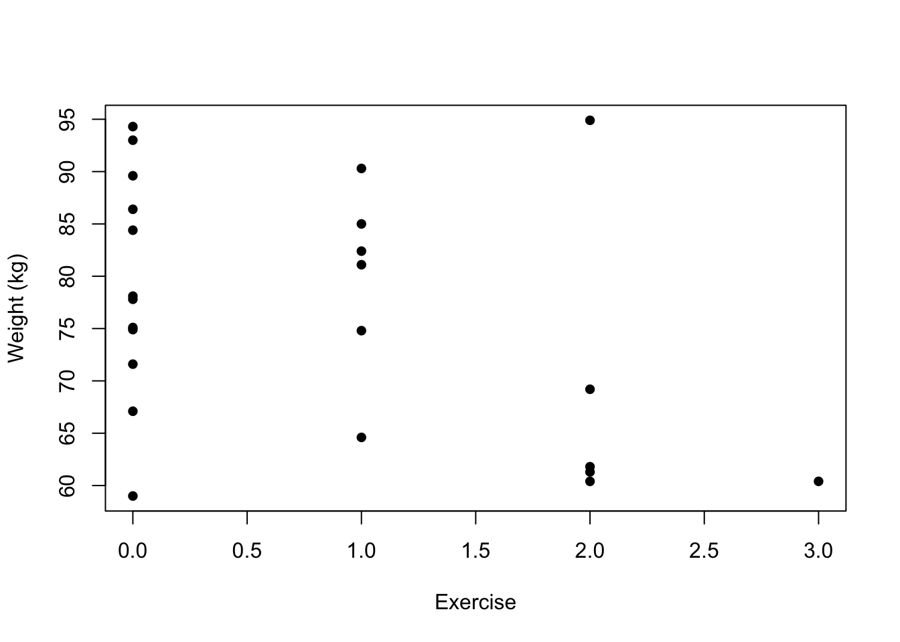

# Introduction

Regression is one of the fundamental topics in statistical modelling, providing a mechanism for expressing the potential dependence of some response of interest on a number of covariates. Its uses are widespread, permeating almost every scientific field, providing the bedrock for analysis of data arising from medicine, population health, demography, agriculture, sports and many more. In this module we will focus on the particular modelling case of when the response variable is continuous.

We will begin with a recap of the multiple linear regression model in chapter 1, extending some of the ideas you have seen in MAS2902. Subsequently, we will consider checking our core assumptions and using regression diagnostics to identify any unusual observations. The method of analysis of variance (anova) will then be introduced in chapter 3, allowing us to remove predictors from a model using the extra sum of squares technique. The fourth chapter will introduce indicator variables to handle binary explanatory variables and consider model selection techniques. Focus then shifts in chapter 5 to looking at models to handle factors in the context of designed experiments, giving rise to classic one-way and two-way anova models. 

<!-- The long-term aim is to build towards a framework of a general linear model, which will itself be developed further in MAS3906 (should you take this optional module) to allow for response variables of alternative types, i.e. binary or count data, via a generalised linear model. -->

## Multiple linear regression
As you have seen in MAS2902, there are often several possible explanatory variables to consider in a regression model. For example, in modelling someone’s weight we may want to include height and age (as well as a few other things) as covariates. We can extend the simple linear regression model to the multiple linear regression model
\[
Y_i = \beta_0 + \beta_1 x_{i1} + \beta_2 x_{i2} + \ldots \beta_p x_{ip} + \epsilon_i (\#eq:mlrmodel)
\]
for $i = 1, \ldots n$. As in simple linear regression, we make assumptions about the (unobserved) error terms, namely that they have zero mean and are independently normally distributed, i.e. $\epsilon_i \sim N(0, \sigma_{\epsilon}^2)$ and $\textrm{Cov}(\epsilon_i, \epsilon_j) = 0$.

Note our model in \@ref(eq:mlrmodel) is called a multiple linear regression model because it is linear in the *parameters*, $\vec{\beta}  = \left(\beta_0, \ldots, \beta_p\right)^T$ - it does not have to be linear in the explanatory variables. For example, the following are multiple linear regression models
\begin{eqnarray*}
Y_i &=& \beta_0 + \beta_1 x_i + \beta_2 x_i^2 + \epsilon_i \\
Y_i &=& \beta_0 + \beta_1 x_{i1} + \beta_2 x_{i2}^2 + \beta_3 \ln x_{i3} + \epsilon_i
\end{eqnarray*}
for $i = 1, \ldots n$. To see this, we can substitute $w_i$, say, for $x_i^2$ in the first model. However, the below example is not a multiple linear regression model:
\[
Y_i = \beta_0 + e^{\beta_1 x_{i1} + \beta_2 x_{i2}} + \epsilon_i \;\; \textrm{for}\;\; i = 1, \ldots n.
\]
Sometimes seemingly nonlinear models can be transformed to linear models, but this will have a knock-on effect on the assumptions.

## Matrix form of the model
Suppose we have $n$ observations then equation \@ref(eq:mlrmodel) gives us the following system of equations:
\begin{eqnarray*}
Y_1 &=& \beta_0 + \beta_1 x_{11} + \beta_2 x_{12} + \ldots \beta_p x_{1p} + \epsilon_1 \\
Y_2 &=& \beta_0 + \beta_1 x_{21} + \beta_2 x_{22} + \ldots \beta_p x_{2p} + 
\epsilon_2 \\
&\vdots& \\
Y_n &=& \beta_0 + \beta_1 x_{n1} + \beta_2 x_{n2} + \ldots \beta_p x_{np} + 
\epsilon_n.
\end{eqnarray*}

Note that the sample size is usually far greater than the number of covariates ($n>>p$), i.e. the problem is \textit{regular}. This set-up is more conveniently represented in matrix format by placing
\begin{enumerate}[(i)]
\item $Y_i$ values in a vector, $\vec{Y}$;
\item $x_{ij}$ values in a (design) matrix $\up{X}$;
\item $\epsilon_i$ values in a vector $\vec{\epsilon}$;
\item $\beta_j$ values in a vector $\vec{\beta}$.
\end{enumerate}
This leads to
\begin{align*}
\begin{pmatrix}
        Y_1 \\
	Y_2 \\
 	\vdots \\
 	Y_n \\
         \end{pmatrix} =  
             \begin{pmatrix}
	1 & x_{11} & x_{12}& \ldots& x_{1p} \\
	1 & x_{21} & x_{22}& \ldots& x_{2p} \\
\vdots& \vdots& \vdots& \vdots& \vdots \\
	1 & x_{n1} & x_{n2}& \ldots& x_{np} \\
         \end{pmatrix}
         \begin{pmatrix}
        \beta_0 \\
	\beta_1 \\
 	\vdots \\
 	\beta_p
         \end{pmatrix} +
         \begin{pmatrix}
       	\epsilon_1 \\
	\epsilon_2 \\
	\vdots \\
 	\epsilon_n
         \end{pmatrix}.
   \end{align*}
This can be compactly written as
\begin{equation}
\vec{Y} = \up{X}\vec{\beta} + \vec{\epsilon}.
\end{equation}
The associated dimensions are.   
(i) $[n \times 1]$ for the *response vector*, $\vec{Y}$,  
(ii) $[n \times (p+1)]$ for the *design matrix*, $\up{X}$,  
(iii) $[(p+1) \times 1]$ for the *parameter vector*, $\vec{\beta}$,  
(iv) $[n \times 1]$ for the *error vector*, $\vec{\epsilon}$.  
The column of '1's in the design matrix is necessary to give the constant term for each observation, i.e. the intercept. We will discuss the role of the intercept in greater detail later. We can collect the covariate information for each item or individual into a vector alongside the '1' for the intercept:
\[
\vec{x}_i =
\begin{pmatrix}
1 \\
x_{i1} \\
x_{i2} \\
\vdots \\
x_{ip}
\end{pmatrix},
\]
for $i = 1, \ldots, n$. This allows us to express the design matrix as
\[
\up{X} =
\begin{pmatrix}
\vec{x}_1^T \\
\vec{x}_2^T \\
\vdots \\
\vec{x}_n^T
\end{pmatrix}.
\]

It is sometimes convenient to set $\vec{x}_i^* = (x_{i1}, x_{i2}, \ldots x_{ip})$
for $i = 1, \ldots, n$. This is the vector of explanatory variables alone (i.e. no intercept term) for the $i^{th}$ observation, which we will make use of later. We will now illustrate the multivariate regression model with a few examples. 

## Example - Matrix form for pre-diabetes data {-}
We now introduce a specific example, which we shall return to throughout the chapter. In a study on body weight in 24 patients over 50, who have been diagnosed with pre-diabetes. Data were collected on their weight (in kilograms), food consumption (in calories), and a(n) (ordinal) measure of how much exercise each patient takes, on average per week: 0 = no exercise, 1 = some exercise, 2 = moderate exercise, 3 = heavy exercise. The food consumption was calculated by averaging over a week’s consumption and we will treat the ordinal covariate (exercise) as if it was continuous. The full data are given in Table \@ref(tab:bodyweight)


Table: (\#tab:bodyweight)Weight, average food consumption and exercise score for twenty-four pre-diabetes patients in body weight study.

| Weight (kg)| Consumption (cal)| Exercise| Weight (kg)| Consumption (cal)| Exercise|
|-----------:|-----------------:|--------:|-----------:|-----------------:|--------:|
|        60.4|              2680|        3|        84.4|              3160|        0|
|        81.1|              3280|        1|        93.0|              3330|        0|
|        94.9|              3890|        2|        61.3|              2360|        2|
|        86.4|              3170|        0|        74.9|              3030|        0|
|        90.3|              3390|        1|        94.3|              3390|        0|
|        60.4|              2670|        2|        61.8|              2700|        2|
|        77.8|              2770|        0|        78.1|              3090|        0|
|        85.0|              3330|        1|        74.8|              3020|        1|
|        71.6|              2710|        0|        59.0|              2410|        0|
|        64.6|              2600|        1|        69.2|              2830|        2|
|        75.1|              2880|        0|        67.1|              2620|        0|
|        89.6|              3430|        0|        82.4|              2820|        1|

We can produce scatterplots of weight against consumption and exercise:

<div class="figure" style="text-align: center">

<p class="caption">(\#fig:unnamed-chunk-1)Scatterplot of weight against (average) food consumption (left) and exercise (right) for the pre-diabetes data</p>
</div>

Comments:   

1. We see that body weight is approximately linearly related to food consumption with a positive slope. There may be one unusual observation (top-right)? Could this be influential? Could others? We will consider these questions in more detail in the next chapter.  

1. There is some evidence that body weight declines with increasing exercise but the effect is possibly being masked by the variability in food consumption. Note that we observe vertical strips when dealing with ordinal variables so trends are perhaps harder to see. 

We wish to fit the model:
\[
\gap{Y_i = \beta_0 + \beta_1 x_{i1} + \beta_2 x_{i2} + \epsilon_i}
\]
for $i = 1, \ldots, n$, where $x_{i1}$ is food consumption and $x_{i2}$ is exercise for the $i^{th}$ patient. Equivalently, using our matrix formulation, we can express the model as
\[
\gap{\vec{Y} = \up{X}\vec{\beta} + \vec{\epsilon}}
\]
We can define the relevant quantities using the available data for the multiple linear regression model as follows:
\begin{align*}
\gap{
\vec{Y} =
\begin{pmatrix}
    60.4     \\
	81.1 \\
  \vdots \\
 	82.4 \\
         \end{pmatrix}, 
         	\up{X} =
     \begin{pmatrix}
	1 & 2680& 3  \\
	1 & 3280& 1  \\
  \vdots& \vdots& \vdots \\
	1 & 2820& 1 \\
         \end{pmatrix},
         \vec{\beta} = \begin{pmatrix}
        \beta_0 \\
	\beta_1 \\
	\beta_2 \\
         \end{pmatrix},
         \vec{\epsilon} =    \begin{pmatrix}
  \epsilon_1 \\
	\epsilon_2 \\
  \vdots \\
	\epsilon_{24} \\
         \end{pmatrix}.}
   \end{align*}

Note that both $\vec{Y}$ and $\vec{\epsilon}$ are unchanged by the addition of variables since these are fixed data in the case of the former, and, as yet, unknown errors in the case of the latter - note that since there is a single error term, $\epsilon_i$, for each observation, $Y_i$, the errors will always form a vector of length $n$. 

The residuals (which estimate the errors) can also be collected in a vector of length $n$, but we only know the values of the residuals *after* model fitting and their values will be different under each model. Both $\up{X}$ and $\vec{\beta}$ do change, with the addition of a column and row respectively for each additional covariate.

## Parameter estimation
Having set up the model, how do we obtain estimates for the unknown parameters? One approach is to use maximum likelihood. 

In order to set the scene, recall that our key assumptions are normality, zero mean, common variance and independence of the errors, i.e. $\epsilon_i \sim N(0, \sigma_{\epsilon}^2)$ and $\textrm{Cov}(\epsilon_i, \epsilon_j) = 0, i \neq j$. Since $Y_i = \beta_0 + \beta_1 x_{i1} + \ldots + \beta_p x_{ip} + \epsilon_i$, then the normality assumption on $\epsilon_i$ induces a normal distribution on each $Y_i$ (and, in turn, the vector $\vec{Y}$). The values for the covariates are fixed, as are the true (usually unknown) values of $\vec{\beta}$ so these just serve as constants when thinking about the distribution of $Y_i$. 

Furthermore, the assumption of independence also carries through and the variance is unaltered (since we are simply adding scalars to a random variable). This tells us that $Y_i \mid \vec{x}_i, \vec{\beta}, \sigma_{\epsilon}^2 \sim N(\beta_0 + \beta_1 x_{i1} + \ldots + \beta_p x_{ip}, \sigma_{\epsilon}^2)$ for $i = 1, \ldots, n$. This can be written more compactly as $Y_i \mid \vec{x}_i, \vec{\beta}, \sigma_{\epsilon}^2 \sim N(\vec{x}_i^T\vec{\beta}, \sigma_{\epsilon}^2)$. 

Before going further, recall that the probability density function for a univariate normal random variable, $Y \sim N(\mu, \sigma^2)$, is:
\[
\gap{f(y \mid \mu, \sigma^2) = \frac{1}{\sqrt{2\pi\sigma^2}}
\exp\left\{-\frac{(y - \mu)^2}{2\sigma^2}\right\}}
\]

The likelihood principle instructs us to pick values of the parameters that maximise the likelihood. If observations are independent (as we have just shown they are here), then the likelihood function for all observations is a product of the individual normal densities for each observation of the form:
\[
\gap{L(\mu, \sigma^2 \mid y_1, \ldots, y_n) = \prod_{i=1}^n f(y_i \mid \mu, \sigma^2).}
\]
Now, for our multiple linear regression model, we have
\begin{align*}
\gap{L(\vec{\beta}, \sigma_{\epsilon}^2 \mid y_1, \ldots, y_n, \up{X})} &\gap{= \prod_{i=1}^n f(y_i \mid \vec{x}_i, \vec{\beta}, \sigma_{\epsilon}^2)} \\
&\gap{= \prod_{i=1}^n \frac{1}{\sqrt{2\pi\sigma_{\epsilon}^2}}
\exp\left\{-\frac{(y_i - \vec{x}_i^T\vec{\beta})^2}{2\sigma_{\epsilon}^2}\right\}} \\
&\gap{= (2\pi\sigma_{\epsilon}^2)^{-n/2}
\exp\left\{-\frac{1}{2\sigma_{\epsilon}^2}\sum_{i=1}^n (y_i - \vec{x}_i^T\vec{\beta})^2 \right\}}  \\
&\gap{= (2\pi)^{-n/2} (\sigma_{\epsilon}^2)^{-n/2}
\exp\left\{-\frac{1}{2\sigma_{\epsilon}^2}\sum_{i=1}^n (y_i - \vec{x}_i^T\vec{\beta})^2 \right\}} \\
\end{align*}

### Estimation of $\vec{\beta}$
To estimate the parameter vector, $\vec{\beta}$ we consider the log-likelihood since this is typically easier to work with, being additive as opposed to multiplicative. The log-likelihood is given by
\begin{equation*}
\gap{\ell(\vec{\beta}, \sigma_{\epsilon}^2 \mid y_1, \ldots, y_n, \up{X}) = -\frac{n}{2} \ln(2\pi) -\frac{n}{2} \ln (\sigma_{\epsilon}^2) - \frac{1}{2\sigma_{\epsilon}^2} \sum_{i=1}^n (y_i - \vec{x}_i^T\vec{\beta})^2}
\end{equation*}
We could (partially) differentiate with respect to each element of $\vec{\beta}$ and this would lead to a system of equations (with a lot of structure) known as the normal equations. However, it is easier to consider the matrix formulation of the model by noting that
\[
\sum_{i=1}^n (y_i - \vec{x}_i^T\vec{\beta})^2 = (\vec{y} - \up{X}\vec{\beta})^T
(\vec{y} - \up{X}\vec{\beta})
\]

This is, in fact, the exact quantity that is minimised using the method of least squares, which can also be used to estimate the parameters for this model (and simple linear regression). Now, ignoring the constant terms (by treating $\sigma_{\epsilon}^2$ as fixed at this stage), we wish to minimise
\begin{align*}
\gap{(\vec{y} - \up{X}\vec{\beta})^T (\vec{y} - \up{X}\vec{\beta})} &\gap{=
(\vec{y}^T - \vec{\beta}^T\up{X}^T)(\vec{y} - \up{X}\vec{\beta})} \\
&\gap{= \vec{y}^T\vec{y} - \vec{y}^T\up{X}\vec{\beta} - \vec{\beta}^T\up{X}^T\vec{y} + \vec{\beta}^T\up{X}^T \up{X}\vec{\beta}}
\end{align*}

By noting that $\vec{y}^T\up{X}\vec{\beta}$ is a scalar we can rewrite this as its transpose, i.e. $\vec{y}^T\up{X}\vec{\beta} = \vec{\beta}^T\up{X}^T\vec{y}$. Hence
\[
\gap{(\vec{y} - \up{X}\vec{\beta})^T (\vec{y} - \up{X}\vec{\beta}) = 
\vec{y}^T\vec{y} -  2\vec{\beta}^T\up{X}^T\vec{y} + \vec{\beta}^T\up{X}^T \up{X}\vec{\beta}}
\]

We can now differentiate to obtain
\[
\gap{\frac{\partial \ell}{\partial \vec{\beta}} = -  2\up{X}^T\vec{y} + 2\up{X}^T \up{X}\vec{\beta}}
\]

Setting equal to zero and solving for $\vec{\beta}$ leads to the solution
\begin{equation}
\gap{\vec{\hat{\beta}} = (\up{X}^T\up{X})^{-1}\up{X}^T\vec{y}}
\end{equation}

This estimate exists as long as the inverse exists, i.e. no column of $\up{X}$ is a linear combination of other columns, i.e. there is no multicollinearity. We have to be careful that no columns of $\up{X}$ are \textit{nearly} linearly related as this can be harder to detect and leads to serious issues; we will discuss multicollinearity in more detail in section \@ref(sec:multicol).

### Estimation of $\sigma_{\epsilon}^2$
We can estimate $\sigma_{\epsilon}^2$ in a similar fashion (now treating $\vec{\beta}$ as fixed), using maximum likelihood once more. Recall that
\begin{equation*}
\ell(\vec{\beta}, \sigma_{\epsilon}^2 \mid y_1, \ldots, y_n, \up{X}) = -\frac{n}{2} \ln(2\pi) -\frac{n}{2} \ln (\sigma_{\epsilon}^2) - \frac{1}{2\sigma_{\epsilon}^2} \sum_{i=1}^n (y_i - \vec{x}_i^T\vec{\beta})^2.
\end{equation*}

For ease of calculation we let $\tau = \sigma_{\epsilon}^2$ and then differentiating with respect to $\tau$ we obtain
\begin{equation*}
\gap{\frac{\partial \ell}{\partial\tau} = -\frac{n}{2\tau} + 
\frac{\sum (y_i - \vec{x}_i^T\vec{\beta})^2}{2\tau^2}}
\end{equation*}

Setting the above equal to zero and solving for $\tau$ we obtain
\begin{equation}
\gap{\hat{\tau} = \frac{\sum (y_i - \vec{x}_i^T\vec{\beta})^2}{n} = 
\frac{\sum (y_i - \hat{y_i})^2}{n}.}
\end{equation}

However, this is a biased estimate (akin to the sample variance bias problem), so we adjust for the fact that we have estimated the $p$-vector $\vec{\beta}$ by using
$$
\gap{\hat{\sigma}_{\epsilon}^2 = s^2 = \frac{\sum (y_i - \hat{y_i})^2}{n - p - 1} } (\#eq:ssquared)
$$

where $p$ is the number of explanatory variables in the model. Note that $\vec{\beta}$ has length $k = p+1$ typically, with the additional intercept term.

### Residuals, fitted values and the 'hat matrix' {#sec:resfithat}
The vector of residuals (which estimate the errors) can be obtained by subtraction after model fitting, namely as 'observed - fitted'
\begin{align*}
\gap{\vec{\hat{\epsilon}}} &\gap{= \vec{y} - \vec{\hat{y}}} \\
&\gap{= \vec{y} - \up{X}\vec{\hat{\beta}},}
\end{align*}
where the fitted values are found as $\vec{\hat{y}} = \up{X}\vec{\hat{\beta}}$.

#### The hat matrix {-}
We can rewrite the estimate for the errors by substituting in $\vec{\hat{\beta}} = (\up{X}^T\up{X})^{-1}\up{X}^T\vec{y}$ to obtain 
\begin{align*}
\gap{\vec{\hat{\epsilon}}} &\gap{= \vec{y} - \up{X}(\up{X}^T\up{X})^{-1}\up{X}^T\vec{y}} \\
&\gap{= (\up{I} - \up{X}(\up{X}^T\up{X})^{-1}\up{X}^T) \vec{y}} \\
&\gap{= (\up{I} - \up{H})\vec{y},}
\end{align*}
where $\up{H} = \up{X}(\up{X}^T\up{X})^{-1}\up{X}^T$. $\up{H}$ is known as the 'hat' matrix since
\begin{align*}
\gap{\vec{\hat{y}}} &\gap{= \up{X}\vec{\hat{\beta}}} \\
&\gap{= \up{X}(\up{X}^T\up{X})^{-1}\up{X}^T\vec{y}} \\
&\gap{= \up{H}\vec{y}.}
\end{align*}

Hence, multiplying by $\up{H}$ converts $\vec{y}$ to $\vec{\hat{y}}$, i.e. it is the matrix that puts a hat on $\vec{y}$. The hat matrix is an $n \times n$ matrix with elements
\begin{align*}
\gap{\up{H} =
\begin{pmatrix}
  h_{11}& h_{12}& \ldots& h_{1n} \\
  h_{21}& h_{22}& \ldots& h_{2n} \\
  \vdots& \vdots& & \vdots \\
  h_{n1}& h_{n2}& \ldots& h_{nn} \\
         \end{pmatrix}} \;\;\;\;
\end{align*}

The diagonal values of $\up{H}$ (i.e. the $h_{ii}$ values for $i = 1, \ldots, n$) are called the leverages (see chapter 2).

### Properties of the hat matrix
It turns out that the hat matrix, $\up{H}$, has some useful properties, which will prove to be handy later. Namely, 

1. $\up{H}$ is symmetric, whereby $\up{H}^T = \up{H}$,
1. $\up{H}$ is idempotent, i.e $\up{H}^2 = \up{H}\up{H} = \up{H}$.

#### Proof {-}
1. <span style="color: red">Now</span>
\begin{align*}
\gap{\up{H}^T} &\gap{=\Bigl(\up{X} (\up{X}^T\up{X})^{-1} \up{X}^T\Bigr)^T} \\
&\gap{= \up{X}\left(\up{X}^T\up{X})^{-1}\right)^T \up{X}^T} \\
&\gap{= \up{X}\left(\up{X}^T\up{X})^T\right)^{-1} \up{X}^T} \\
&\gap{= \up{X} (\up{X}^T\up{X})^{-1} \up{X}^T} \\
&\gap{= \up{H}.} \\
\end{align*}
1. <span style="color: red">We now have</span>
\begin{align*}
\gap{\up{H}\up{H}} &\gap{= \Bigl(\up{X} (\up{X}^T\up{X})^{-1} \up{X}^T\Bigr) \Bigl(\up{X} (\up{X}^T\up{X})^{-1} \up{X}^T\Bigr)}  \\
&\gap{= \up{X} (\up{X}^T\up{X})^{-1} \up{X}^T\up{X} (\up{X}^T\up{X})^{-1} \up{X}^T} \\
&\gap{= \up{X} (\up{X}^T\up{X})^{-1} \up{X}^T} \\
&\gap{= \up{H}.} \\
\end{align*}

<!-- ## Example: Simple linear regresion analysis of bodyweight data {-} -->
<!-- We are now in a position to estimate the parameters for the data on pre-diabetes patients introduced earlier. Recall that for the simple linear regression model for the bodyweight data we have the data and design matrix: -->
<!-- \begin{align*} -->
<!-- \vec{Y} = -->
<!-- \begin{pmatrix} -->
<!--   60.4 \\ -->
<!-- 	81.1 \\ -->
<!--   \vdots \\ -->
<!--  	82.4 \\ -->
<!--          \end{pmatrix}, \;\;\;\; -->
<!--          	\up{X} = -->
<!--      \begin{pmatrix} -->
<!-- 	1 & 2680  \\ -->
<!-- 	1 & 3280  \\ -->
<!--   \vdots& \vdots \\ -->
<!-- 	1 & 2820 \\ -->
<!-- \end{pmatrix} -->
<!-- \end{align*} -->

<!-- Hence we can use matrix algebra to calculate -->
<!-- \begin{align*} -->
<!-- \up{X}^T\up{X} &= -->
<!-- \begin{pmatrix} -->
<!-- 24 & 71560  \\ -->
<!-- 71560 & 216577400  \\ -->
<!-- \end{pmatrix}, \\ -->
<!-- \up{X}^T\vec{y} &= \begin{pmatrix} -->
<!-- 1837.50 \\ -->
<!-- 5570449 \\ -->
<!-- \end{pmatrix}. -->
<!-- \end{align*} -->

<!-- We can then find  -->
<!-- \begin{align*} -->
<!-- \gap{(\up{X}^T\up{X})^{-1} = \frac{1}{(24\times 216577400 - 71560^2)} -->
<!-- \begin{pmatrix} -->
<!-- 216577400 & -71560  \\ -->
<!-- -71560 & 24  \\ -->
<!-- \end{pmatrix}} -->
<!-- \end{align*} -->

<!-- Simplifying, we obtain (to 2 d.p.) -->
<!-- \begin{align*} -->
<!-- \gap{ -->
<!-- (\up{X}^T\up{X})^{-1} =  -->
<!-- \begin{pmatrix} -->
<!-- 2.81 & -9.29 \times 10^{-4}  \\ -->
<!-- -9.29 \times 10^{-4} & 3.12 \times 10^{-7}  \\ -->
<!-- \end{pmatrix}} -->
<!-- \end{align*} -->

<!-- So the parameter estimates can be found as -->
<!-- \begin{align*} -->
<!-- \vec{\beta} &= \begin{pmatrix} -->
<!-- 2.81 & -9.29 \times 10^{-4}  \\ -->
<!-- -9.29 \times 10^{-4} & 3.12 \times 10^{-7}  \\ -->
<!-- \end{pmatrix} -->
<!-- \begin{pmatrix} -->
<!-- 1837.50 \\ -->
<!-- 5570449 \\ -->
<!-- \end{pmatrix} \\ -->
<!-- &= \begin{pmatrix} -->
<!-- -8.573 \\ -->
<!-- 0.029 \\ -->
<!-- \end{pmatrix} \\ -->
<!-- \end{align*} -->

<!-- The fitted line is thus -->
<!-- \[ -->
<!-- \gap{\textrm{Weight} = -8.573 + 0.029\times \textrm{Consumption}.} -->
<!-- \]  -->

<!-- This can be interpreted in the usual way, i.e. body weight goes up by 0.029 kg for every additional calorie consumed. This is not particularly helpful in this instance, and it may be more meaningful to express this as the change per 100 calories, say (which would equate to an approximate 3 kg weight increase since $0.029 \times 100 = 2.9$). Note that, as an alternative, we could change the units of the calorie variable at the outset, i.e. before fitting the model, to achieve the same result. -->

<!-- We can also calculate the fitted values -->
<!-- \begin{align*} -->
<!-- \gap{ -->
<!-- \vec{\hat{y}} = \up{X}\vec{\hat{\beta}} = -->
<!-- \begin{pmatrix} -->
<!-- 67.95 \\ -->
<!-- 85.08 \\ -->
<!-- \vdots \\ -->
<!-- 71.95 -->
<!-- \end{pmatrix} \\} -->
<!-- \end{align*} -->

<!-- From the fitted values we can also calculate the residuals -->
<!-- \begin{align*} -->
<!-- \gap{\vec{\hat{\epsilon}} = \vec{y} - \vec{\hat{y}} =  -->
<!-- \begin{pmatrix} -->
<!-- -7.55 \\ -->
<!-- -3.98 \\ -->
<!-- \vdots \\ -->
<!-- 10.45 -->
<!-- \end{pmatrix} \\} -->
<!-- \end{align*} -->

## Example: Multiple linear regresion analysis of bodyweight data {-}
We are now in a position to estimate the parameters for the data on pre-diabetes patients introduced earlier. First we recall that for the multiple linear regression model for the bodyweight data we have the design matrix given by:
\begin{align*}
\up{X} =
     \begin{pmatrix}
	1 & 2680& 3  \\
	1 & 3280& 1  \\
  \vdots& \vdots& \vdots \\
	1 & 2820& 1 \\
\end{pmatrix}
\end{align*}
Using matrix algebra we can calculate
\begin{align*}
\up{X}^T\up{X} &=
\begin{pmatrix}
24 & 71560 & 19  \\
71560 & 216577400 &  55380\\
19 & 55380 &  35\\
\end{pmatrix} \\
\up{X}^T\vec{y} &= \begin{pmatrix}
1837.50 \\
5570449 \\
1354.60
\end{pmatrix}.
\end{align*}

Taking the (3 by 3) matrix inverse we get 

\begin{align*}
(\up{X}^T\up{X})^{-1} = 
\begin{pmatrix}
3.02 & -9.69 \times 10^{-4} & -0.10 \\
-9.69 \times 10^{-4} & 3.20 \times 10^{-7} & 2.04 \times 10^{-5} \\
-0.10 & 2.04 \times 10^{-5} & 0.05 \\
\end{pmatrix}
\end{align*}

Hence, the parameter estimates can be found as

\begin{eqnarray*}
\gap{
\vec{\beta} = (\up{X}^T\up{X})^{-1}\up{X}^T\vec{y}
= (-2.104, 0.027, -3.278)^T.}
\end{eqnarray*}
Note that we can also calculate $\vec{\hat{y}} = \up{X}\vec{\hat{\beta}}$ from the above, and subsequently $\vec{\hat{\varepsilon}} = \vec{y} - \vec{\hat{y}}$. The fitted line for the multiple linear regression model is 
\[
\gap{\textrm{Weight} = -2.014 + 0.027\times \textrm{Consumption} -3.278\times\textrm{Exercise}.}
\]
This can be interpreted in a similar way to simple linear regression, but with a few caveats:

- body weight goes up by 0.027 kg for every additional calorie consumed, \textit{for a fixed value of exercise}.  

- body weight decreases by around 3.3 kg as individuals move up an exercise category, \textit{for a fixed amount of consumption}.  

- be careful not to interpret the above as exercise being 'more important' than consumption due to having a larger coefficient - the scales of the variables are different and we also have no idea (yet!) whether these values are significant.

It may be more meaningful to express the change due to consumption in different units. Also, note that the values of the parameter estimates change with the introduction (or removal) of variables into (from) the model - this is always the case (unless the covariates are independent), no matter how significant (or not) they are. This is important when building a regression model.

We have seen that fitting a multiple linear regression model with two covariates can be achieved `by hand'. However, it is clear that as we look to build more complex models then it may be advantageous to use software - we will see how to do this in section \@ref(sec:mlrinr).

## Expectations, variances and inference
We now consider the properties of the estimators $\vec{\hat{\beta}}$ and $\vec{\hat{\epsilon}}$, i.e. is $\vec{\hat{\beta}}$ unbiased? This will allow us, among other things, to assess the significance (or otherwise) of the parameter estimates. We begin by considering the expectation and variance of $\vec{\hat{\beta}}$.

### Expectation of $\vec{\hat{\beta}}$
Now,
\begin{align*}
\gap{\E\left[\vec{\hat{\beta}}\right]} &\gap{= \E\left[\left(\up{X}^T\up{X}\right)^{-1}\up{X}^T\vec{Y}\right]} \\
&\gap{= \left(\up{X}^T\up{X}\right)^{-1}\up{X}^T \E[\vec{Y}]} \\
&\gap{= \left(\up{X}^T\up{X}\right)^{-1}\up{X}^T \up{X}\vec{\beta}} \\
&\gap{= \vec{\beta}}
\end{align*}

Hence, $\vec{\hat{\beta}}$ is an unbiased estimator of $\vec{\beta}$.

### Variance of $\vec{\hat{\beta}}$
Before looking at the variance in detail we note
\[
\left\{\left(\up{X}^T\up{X}\right)^{-1}\up{X}^T\right\}^T = \up{X}\left\{\left(\up{X}^T\up{X}\right)^{-1}\right\}^T = \up{X}\left(\up{X}^T\up{X}\right)^{-1}
\]
since $(\up{X}^T\up{X})^{-1}$ is a symmetric matrix.

We are now in a position to look at the variance
\begin{align*}
\gap{\Var\left[\vec{\hat{\beta}}\right]} &\gap{= \Var\left[\left(\up{X}^T\up{X}\right)^{-1}\up{X}^T\vec{Y}\right]} \\
&\gap{= \left(\up{X}^T\up{X}\right)^{-1}\up{X}^T \Var\left[\vec{Y}\right] \left\{\left(\up{X}^T\up{X}\right)^{-1}\up{X}^T\right\}^T} \\
&\gap{= \left(\up{X}^T\up{X}\right)^{-1}\up{X}^T \up{I}\sigma_{\epsilon}^2 \up{X}\left(\up{X}^T\up{X}\right)^{-1}} \\
&\gap{= \sigma_{\epsilon}^2 \left(\up{X}^T\up{X}\right)^{-1}\up{X}^T \up{X}\left(\up{X}^T\up{X}\right)^{-1}} \\
&\gap{= \sigma_{\epsilon}^2 \left(\up{X}^T\up{X}\right)^{-1}}
\end{align*}

### Inference for $\vec{\hat{\beta}}$ {#sec:inferforbetahat}
Since $\vec{\hat{\beta}}$ consists of linear combinations of the $Y_i$'s, which are independent and normally distributed, it has a multivariate normal distribution, namely $\vec{\hat{\beta}} \sim N_{p+1}\left(\vec{\beta}, \sigma_{\epsilon}^2 (\up{X}^T\up{X})^{-1}\right)$ and each of the individual parameter estimates are univariate normal (due to properties of the multivariate normal distribution). Their (individual) significance can be asssessed via the test statistic 
\[
\gap{\hat{\beta_j}\bigg/\sqrt{v_{jj}s^2} \sim t_{n-p-1}}
\]
where $v_{jj}$ is the $(j+1)^{th}$ diagonal element of $\up{V} = (\up{X}^T\up{X})^{-1}$, and $s^2$ is our (unbiased) estimate of $\sigma_{\epsilon}^2$ from equation \@ref(eq:ssquared). Note the use of the $t$-distribution since we must also estimate $s^2$.

### Expectation and variance of the fitted values {#sec:expvaryhat}
The fitted values are calculated as
\[
\vec{\hat{Y}} = \up{X}\vec{\hat{\beta}}
\]
or equivalently as
\[
\vec{\hat{Y}} = \up{H}\vec{Y}.
\]

Their expectation is

\begin{align*}
\gap{\E\left[\vec{\hat{Y}}\right]} &\gap{= \E\left[\up{X}\vec{\hat{\beta}}\right]} \\
&\gap{=\up{X} \E[\vec{\hat{\beta}}]} \\
&\gap{=\up{X}\vec{\beta}},
\end{align*}

with variance given by

\begin{align*}
\gap{\Var\left[\vec{\hat{Y}}\right]} &\gap{= \Var\left[\up{H}\vec{Y}\right]} \\
&\gap{= \up{H} \Var\left[\vec{Y}\right] \up{H}^T} \\
&\gap{= \up{H} \up{I}\sigma_{\epsilon}^2 \up{H}^T} \\
&\gap{= \up{H}\up{H}\sigma_{\epsilon}^2} \\
&\gap{= \up{H} \sigma_{\epsilon}^2} 
\end{align*}
Hence, the variability of the fitted values depends on the hat matrix, $\up{H}$. We will discuss this further in chapter 2.

### Expectation and variance of the residuals
Recall that the residuals are found as
\[
\gap{\vec{\hat{\epsilon}} = \vec{Y} - \vec{\hat{Y}}.}
\]
or alternatively as
\[
\gap{\vec{\hat{\epsilon}} = (\up{I} - \up{H})\vec{Y}.}
\]

We can find the expectation and variance as
\begin{align*}
\gap{\E[\vec{\hat{\epsilon}}]} & \gap{= \E[\vec{Y} - \vec{\hat{Y}}]} \\
&\gap{= \E[\up{X}\vec{\beta}] - \E\left[\up{X}\vec{\hat{\beta}}\right]} \\
&\gap{= \up{X}\vec{\beta} - \up{X}\vec{\beta}} \\
&\gap{= \vec{0},}
\end{align*}
and
\begin{align*}
\gap{\Var[\vec{\hat{\epsilon}}]} &\gap{= \Var[(\up{I} - \up{H})\vec{Y}]} \\
&\gap{= (\up{I} - \up{H})\Var[\vec{Y}](\up{I} - \up{H})^T} \\
&\gap{= (\up{I} - \up{H})\sigma_{\epsilon}^2\up{I}(\up{I} - \up{H})} \\
&\gap{= \sigma_{\epsilon}^2(\up{I} - \up{H} - \up{H} + \up{H}\up{H})} \\
&\gap{= \sigma_{\epsilon}^2(\up{I} - \up{H}).}
\end{align*}

Note that this implies that, unless all the diagonal values of $\up{H}$ are equal then the errors have different variances, and that these variances are smaller for larger values of $h_{ii}$, i.e. higher leverages (see chapter 2).

## Multiple linear regression in `R` {#sec:mlrinr}
Once we start to think about large datasets and a large number of parameters, finding the parameter estimates by hand becomes laborious, not to mention the possibility of both data entry and/or numerical errors occurring increases greatly. Happily, we can use `R` to conduct the analyses instead.

### Using data in `R`
There are various ways of using data with `R`. Data can be read in manually, i.e.


``` r
## Type the data in the console
bodyweight = c(60.4, 81.1, 94.9, 86.4, 90.3, 60.4, 77.8, 85.0, 71.6, 64.6, 75.1, 89.6, 
84.4, 93.0, 61.3, 74.9, 94.3, 61.8, 78.1, 74.8, 59.0, 69.2, 67.1, 82.4)
```

The majority of the time, in this module and the wider world, the (external) data in the file `ExternalData.RData` will be read/loaded directly into `R`, e.g.

``` r
## Load in an external dataset
load("ExternalData.RData")
```

Alternatively, we may sometimes make use of datasets that are internal to `R` in that they are part of an `R` package, i.e. for the dataset `InternalRDataset`:

``` r
## Load in an internal dataset
data(InternalRDataset)
```

To view the available datasets in `R` we can type `data()` at the console, or, for datasets attached to a particular package we can use `data(library = "Rpackage")`.

## Example: Analysis of bodyweight data using `R` {-}
To use `R` for the plots and analysis seen earlier:

``` r
## Load the data
load("bodyweight.RData")
```


``` r
## Plots
# Weight versus consumption
plot(Weight ~ Consumption, data = bodyweight, pch = 16)
# Weight versus exercise
plot(Weight ~ Exercise, data = bodyweight, pch = 16)
```


``` r
## Analysis
# Simple linear regression on consumption
fit1 <- lm(Weight ~ Consumption, data = bodyweight)
# Multiple linear regression on consumption & exercise
fit2 <- lm(Weight ~ Consumption + Exercise, data = bodyweight)
```

We can inspect a model fit using various commands
<ol type="i">
<li> The `summary()` command gives an overview of the fit </li>

``` r
summary(fit2)
```

```
## 
## Call:
## lm(formula = Weight ~ Consumption + Exercise, data = bodyweight)
## 
## Residuals:
##     Min      1Q  Median      3Q     Max 
## -5.5751 -2.5704 -0.7894  2.4049 10.9266 
## 
## Coefficients:
##              Estimate Std. Error t value Pr(>|t|)    
## (Intercept) -2.104925   7.017861  -0.300  0.76717    
## Consumption  0.027254   0.002286  11.921 8.23e-11 ***
## Exercise    -3.278296   0.916795  -3.576  0.00178 ** 
## ---
## Signif. codes:  0 '***' 0.001 '**' 0.01 '*' 0.05 '.' 0.1 ' ' 1
## 
## Residual standard error: 4.044 on 21 degrees of freedom
## Multiple R-squared:  0.8916,	Adjusted R-squared:  0.8813 
## F-statistic:  86.4 on 2 and 21 DF,  p-value: 7.346e-11
```
We will consider output of this nature in detail later in the module.
<li> The fitted values and residuals can also be extracted (output - to three decimal places - is suppressed here) 

``` r
round(fitted.values(fit2), 3)
round(residuals(fit2), 3)
```
</li>
<li> The variance-covariance matrix for $\vec{\hat{\beta}}$ is also contained within the fit. For the second model fit we get

``` r
vcov(fit2)
```

```
##             (Intercept)   Consumption      Exercise
## (Intercept)  49.2503765 -1.584890e-02 -1.6584367474
## Consumption  -0.0158489  5.227021e-06  0.0003330453
## Exercise     -1.6584367  3.330453e-04  0.8405137595
```
</li>
<li> The hat-values that make up the diagonal of the $\up{H}$ matrix can also be found - again we round to three decimal places:

``` r
round(hatvalues(fit2), 3)
```

```
##     1     2     3     4     5     6     7     8     9    10    11    12    13 
## 0.294 0.075 0.425 0.079 0.101 0.132 0.095 0.086 0.106 0.087 0.080 0.124 0.078 
##    14    15    16    17    18    19    20    21    22    23    24 
## 0.101 0.210 0.073 0.114 0.128 0.074 0.045 0.197 0.117 0.127 0.051
```
</li>
<li> We can also add a fitted regression line to a scatterplot via the `abline()` command:

``` r
plot(Weight ~ Consumption, data = bodyweight, pch = 16)
abline(fit1, lty = 2)
```
</li>
</ol>

## The role of the intercept 
The intercept, via the parameter $\beta_0$, is included as a matter of course when fitting a regression model (the default behaviour in R is to have an intercept present in a model). Why is this the case? What would happen if we removed the intercept?

Suppose we thought that we should fit the model without an intercept, then the multiple linear regression model takes the form
\[
\gap{Y_i = \beta_0 + \beta_1 x_{i1} + \beta_2 x_{i2} + \ldots \beta_p x_{ip} + \epsilon_i (\#eq:mlrmodelnoint)}
\]
for $i = 1, \ldots, n$. Or, equivalently, in matrix notation
\begin{equation}
\gap{\vec{Y} = \up{\tilde{X}}\vec{\beta} + \vec{\epsilon}.}
\end{equation}
where $\up{\tilde{X}}$ represents the design matrix that does not now have a first column of '1's.

## Example: Analysis of bodyweight data without an intercept term {-}
Returning to our example on pre-diabetes we would have
\begin{align*}
\gap{\vec{Y} =
\begin{pmatrix}
    60.4     \\
	81.1 \\
  \vdots \\
 	82.4 \\
         \end{pmatrix}, 
         	\up{\tilde{X}} =
     \begin{pmatrix}
	2680& 3  \\
	3280& 1  \\
  \vdots& \vdots \\
	2820& 1 \\
         \end{pmatrix},
         \vec{\beta} = \begin{pmatrix}
	\beta_1 \\
	\beta_2 \\
         \end{pmatrix},
         \vec{\epsilon} =    \begin{pmatrix}
  \epsilon_1 \\
	\epsilon_2 \\
  \vdots \\
	\epsilon_{24} \\
         \end{pmatrix}.}
   \end{align*}

Note that $\vec{Y}$ and $\vec{\epsilon}$ are unchanged, whereas both the design matrix and $\vec{\beta}$ are affected by the removal of the intercept term.

Upon fitting we would obtain the fitted model
\[
\textrm{Weight} = \hat{\beta}_1\times \textrm{Consumption} + \hat{\beta}_2\times\textrm{Exercise}.
\]

This model - and the equivalent model with an intercept term - assumes the relationship between weight and consumption remains the same for all values of calorific consumption and exercise. Moreover, the model without the intercept further assumes that zero calorie intake and zero exercise gives zero body weight! 

This may well not be true (or possible), not just here but for many datasets. Forcing a zero intercept can give nonsensical values for the predicted response and it can also severely affect the fit of the regression line, particularly if our estimate of the intercept is significantly different from zero. In the absence of an intercept term, the line of best fit is forced to go through the origin. We will now investigate further with another example. 

## Example: Analysis of men's Premier League football data - the role of the intercept {-}
The data in the following example comes from the 2012-13 men's English Premier League final football table (on Canvas in the file *prem.RData*). For each team the number of points they achieved (the response - why?), goals they scored, conceded, and their goal difference (scored - conceded) are recorded, alongside how many times they did not concede a goal (a 'clean sheet'), which will be our primary focus for now. A snapshot of the data are given below:


``` r
load("prem.RData")
kable(head(prem, 5))
```


| Position|Team              | Scored| Conceded| GoalDifference| Points| CleanSheets|
|--------:|:-----------------|------:|--------:|--------------:|------:|-----------:|
|        1|Manchester United |     86|       43|             43|     89|          13|
|        2|Manchester City   |     66|       34|             32|     78|          18|
|        3|Chelsea           |     75|       39|             36|     75|          14|
|        4|Arsenal           |     72|       37|             35|     73|          14|
|        5|Tottenham Hotspur |     66|       46|             20|     72|           9|
Below is a scatterplot of points against clean sheets:
<div class="figure" style="text-align: center">

<p class="caption">(\#fig:premplot1)Scatterplot of points against clean sheets for the Premier League 2012/13 data.</p>
</div>

<ol type="a">
  <li>Fit a simple linear regression model with clean sheets as the sole covariate. Overlay the regression line on the scatterplot of the raw data and comment.

``` r
fitprem1 <- lm(Points ~ CleanSheets, data = prem)
plot(Points ~ CleanSheets, data = prem, pch = 16, xlim = c(0, 25), ylim = c(0, 100))
abline(fitprem1, lty = 2, lwd = 1.5, col = "red")
```

<div class="figure" style="text-align: center">

<p class="caption">(\#fig:premfitted1)Scatterplot of points against clean sheets for the Premier League 2012/13 data with overlaid model fit.</p>
</div>
</li>
  <li>Fit a second model, this time without an intercept and overlay this regression line. What do you observe?  
<span style="color: red">We can fit the second model and overlay the line using:</span>

``` r
fitprem2 <- lm(Points ~ CleanSheets - 1, data = prem)
abline(fitprem2, lty = 3, lwd = 1.5)
```
<div class="figure" style="text-align: center">

<p class="caption">(\#fig:premfitted2)Scatterplot of points against clean sheets for the Premier League 2012/13 data with two overlaid model fits.</p>
</div>
</ol>

<span style="color: red">We can see that the model without the intercept has a different slope since $\hat{\beta}_0$ and $\hat{\beta}_1$ are correlated (see MAS2902). Note also that the line of best fit for the model without the intercept is forced to go through the origin. Both models seem to do a reasonable job - assessing by eye - of capturing the relationship between points and clean sheets. This is not always the case though, as we will see in practical 1.</span>

### Interpretability of the intercept and extrapolation
Having established that including an intercept is a sensible thing to do, we now move on to the question of its interpretation. Note that we did not formally interpret the intercept in our previous analysis of the bodyweight data, and this is common practice. 

However, if we did wish to say something meaningful about the intercept how would we go about it? We first inspect the fit for our first model from the previous example:


``` r
summary(fitprem1)
```

```
## 
## Call:
## lm(formula = Points ~ CleanSheets, data = prem)
## 
## Residuals:
##      Min       1Q   Median       3Q      Max 
## -16.6526  -7.9816  -0.7842   7.0974  26.8211 
## 
## Coefficients:
##             Estimate Std. Error t value Pr(>|t|)    
## (Intercept)  16.3368     8.0303   2.034 0.056915 .  
## CleanSheets   3.5263     0.7544   4.674 0.000189 ***
## ---
## Signif. codes:  0 '***' 0.001 '**' 0.01 '*' 0.05 '.' 0.1 ' ' 1
## 
## Residual standard error: 12.3 on 18 degrees of freedom
## Multiple R-squared:  0.5483,	Adjusted R-squared:  0.5232 
## F-statistic: 21.85 on 1 and 18 DF,  p-value: 0.0001888
```

<div class="figure" style="text-align: center">

<p class="caption">(\#fig:unnamed-chunk-15)Scatterplot of points against clean sheets for the Premier League 2012/13 data with overlaid model fit.</p>
</div>

We see that the estimate of the intercept, $\hat{\beta}_0$, is 16.34. This tells us that when clean sheets takes the value zero, then we would expect a team to obtain around 16 points (as points is an integer we round). Here this makes some sense, since no clean sheets would mean a team concedes at least one goal in every match they play. Note, however, that the smallest observed value for this variable is five, so by using the value of zero we are extrapolating beyond the observed range of our data and this can be problematic.

### Mean-centering of covariates
Without any data manipulation prior to model fitting we have seen that the estimate for the intercept is interpreted as the value for the response when all of the covariates take the value zero. This, however, might be a scenario that is either not likely (i.e. a weight of zero kg for an adult), or not permissible (amount of a drug administered as part of a treatment) in the context of the data at hand. 

One solution to this issue is to scale the covariates via *mean-centering*.
\[
\gap{\vec{\tilde{x}}^{(j)} = \vec{x}^{(j)} - \bar{x}^{(j)}}
\]
where $j = 1, \ldots, p$, $\vec{x}^{(j)} = (x_{1j}, x_{2j}, \ldots, x_{nj})$ is the vector of values for the $j^{th}$ covariate and $\bar{x}^{(j)}$ is the sample mean for the $j^{th}$ covariate, for example the mean of the exercise values in the bodyweight data. Note the distinction between $\vec{x}^{(j)}$ and $\vec{x}_i$ introduced earlier, which is the vector of values for each individual (or subject).

The intercept has the same interpretation as above, namely the value of the response when the covariates are all simultaneously set to zero, i.e. $\vec{x}_i = \vec{0}$. However, zero is now the *mean* value for each covariate, after mean-centering, so the intercept can also now be interpreted as the value of the response when each covariate is at its (own) *average value*. Furthermore, the value of the intercept turns out to be $\bar{y}$, the sample mean of the response vector. Recall that in simple linear regression
\[
\hat{\beta}_0 = \bar{y} - \hat{\beta}_1 \times \bar{x}
\]
and this will clearly reduce to $\hat{\beta}_0 = \bar{y}$ when $\bar{x} = 0$. This result generalises to the multiple linear regression case.

This tends to give a more intuitive interpretation generally. Mean-centering also removes the correlation between $\beta_0$ and $\beta_1, \ldots \beta_p$. We will now see the effect of mean-centering in an example.

## Example: Mean-centering (men's Premier League football data) {-}
Returning to the data from the men's football Premier League. Below is a scatterplot of points against the raw (solid circles) and mean-centered (triangles) versions of our clean sheets covariate.

<div class="figure" style="text-align: center">

<p class="caption">(\#fig:unnamed-chunk-16)Scatterplot of points against the observed clean sheets (solid circles) and their mean-centered counterpart (triangles).</p>
</div>

<ol type="a">
  <li> Fit a model using a mean-centered version of clean sheets.     
  [Hint: use the `scale` command in `R` to perform the mean-centering].     
  <span style="color: red">We fit - and inspect - the model using the `R` commands</span> 

``` r
CleanSheetsScaled <- scale(prem$CleanSheets, 
                           scale = FALSE)
fit_mean_centre <- lm(Points ~ CleanSheetsScaled, 
                      data = prem)
summary(fit_mean_centre)  
```

```
## 
## Call:
## lm(formula = Points ~ CleanSheetsScaled, data = prem)
## 
## Residuals:
##      Min       1Q   Median       3Q      Max 
## -16.6526  -7.9816  -0.7842   7.0974  26.8211 
## 
## Coefficients:
##                   Estimate Std. Error t value Pr(>|t|)    
## (Intercept)        51.6000     2.7513  18.755 2.91e-13 ***
## CleanSheetsScaled   3.5263     0.7544   4.674 0.000189 ***
## ---
## Signif. codes:  0 '***' 0.001 '**' 0.01 '*' 0.05 '.' 0.1 ' ' 1
## 
## Residual standard error: 12.3 on 18 degrees of freedom
## Multiple R-squared:  0.5483,	Adjusted R-squared:  0.5232 
## F-statistic: 21.85 on 1 and 18 DF,  p-value: 0.0001888
```
 </li>
  <li> Overlay the lines of best fit for the models using the raw and mean-centered covariates. What do you notice?
<div class="figure" style="text-align: center">

<p class="caption">(\#fig:unnamed-chunk-18)Scatterplot of points against the observed clean sheets (solid circles) and their mean-centered counterpart (triangles) with overlaid lines of best fit.</p>
</div>
</li>
  
<span style="color: red">From the summary, we see that the estimate of the slope is exactly the same as before, i.e. $\hat{\beta}_1 = 3.53$ so the line has the same gradient, but the intercept is different. The intercept estimate is $\hat{\beta}_0 = 51.60$ (recall, it was around 16 earlier) which suggests that a team with the \textit{average} number of clean sheets will obtain around 52 points (nearest integer, as before). This interpretation is cleaner than our earlier interpretation using the raw rather than mean-centered covariate.</span>
</ol>

Although we have illustrated the role of the intercept using simple linear regression, the same ideas hold in the multiple linear regression model. We now return to the issue of multicollinearity.

## Properties of $(\up{X}^T\up{X})^{-1}$: multicollinearity {#sec:multicol}
We saw earlier that both the estimator of $\vec{\beta}$ and its variance both depend on the quantity $\up{X}^T\up{X}^{-1}$. As such, this quantity plays a critical part in fitting a regression model and in determining the significance (or otherwise) of estimated parameters. We will now consider a situation known as *multicollinearity* that leads to problems with taking the inverse of $\up{X}^T\up{X}$.

## Example: Multicollinearity in men's Premier League football data {-}
Returning to the Premier League football data, a sports data analyst sets out to fit the following model:
\[
\textrm{Points}_i = \beta_0 + \beta_1 \textrm{Goal difference}_i + \beta_2 \textrm{Scored}_i + \beta_3 \textrm{Conceded}_i  + \epsilon_i
\]

<ol type="a">
<li> Construct the design matrix $\up{X}$, and hence calculate $\up{X}^T\up{X}$ and $(\up{X}^T\up{X})^{-1}$.

``` r
X <- cbind(1, prem$GoalDifference, prem$Scored, 
           prem$Conceded)
XTX <- crossprod(X)
solve(XTX) 
```
<span style="color: red">The last line fails, we cannot invert the matrix as it is singular.</span>
</li>
<li> Can you spot an obvious problem with this model?

<span style="color: red">The problem here is that one of the variables is a linear combination of the others, namely goal difference which is defined as 'scored' - 'conceded'. This means they are collinear and that we will have problems inverting $\up{X}^T\up{X}$.</span>

</li>
<li> Fit the model in `R` and inspect the fit - what do you notice?

<span style="color: red">Implementing the model we get</span>

``` r
summary(lm(Points ~ GoalDifference + Scored + Conceded, data = prem))
```

```
## 
## Call:
## lm(formula = Points ~ GoalDifference + Scored + Conceded, data = prem)
## 
## Residuals:
##      Min       1Q   Median       3Q      Max 
## -11.0387  -2.7741   0.2508   3.7633   5.7760 
## 
## Coefficients: (1 not defined because of singularities)
##                Estimate Std. Error t value Pr(>|t|)    
## (Intercept)     38.3511     9.6368   3.980 0.000969 ***
## GoalDifference   0.5710     0.1097   5.206 7.13e-05 ***
## Scored           0.2493     0.1803   1.382 0.184780    
## Conceded             NA         NA      NA       NA    
## ---
## Signif. codes:  0 '***' 0.001 '**' 0.01 '*' 0.05 '.' 0.1 ' ' 1
## 
## Residual standard error: 4.471 on 17 degrees of freedom
## Multiple R-squared:  0.9437,	Adjusted R-squared:  0.937 
## F-statistic: 142.4 on 2 and 17 DF,  p-value: 2.404e-11
```
<span style="color: red">There is no parameter estimate or standard error for goals conceded, which seems to have been removed from the model.</span> 
</li>
</ol>

Here it was clear what was driving the multicollinearity, and the issue could be easily spotted, and resolved. Sometimes, however, the problem is more subtle and we will consider this scenario further in practical 1. In the next chapter we will investigate whether our model conforms to assumptions and/or has any unusual observations that warrant further investigation.
